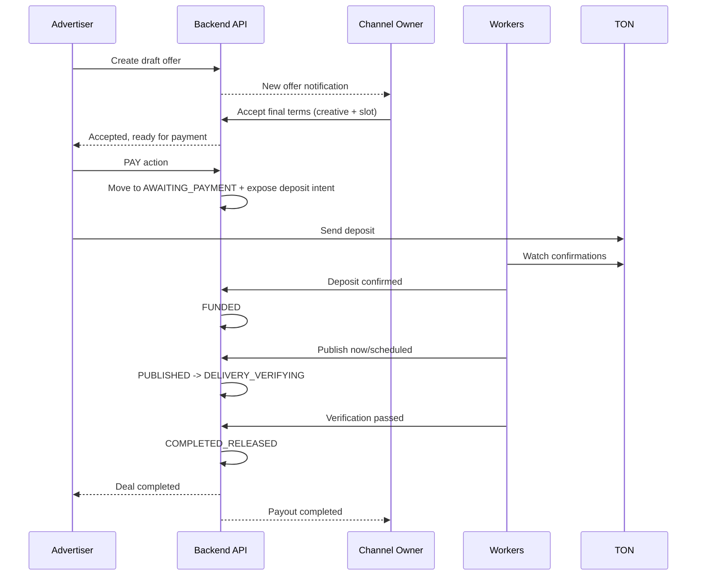

# Feature: Deal Lifecycle

## Overview

A deal is a single advertising agreement between an advertiser and a channel owner.
The lifecycle is optimized for conversion with **Approve -> Pay**:

1. Terms/creative/slot are agreed first.
2. Payment happens only after owner acceptance.
3. Execution, verification, and release are automated.

Legacy note for compatibility checks: this feature was originally documented as a
**state machine with 17 states**, while current runtime uses the simplified canonical set below.

## Happy Path Sequence

## Runtime Statuses

- `DRAFT`
- `OFFER_PENDING`
- `NEGOTIATING`
- `ACCEPTED`
- `AWAITING_PAYMENT`
- `FUNDED`
- `SCHEDULED`
- `PUBLISHED`
- `DELIVERY_VERIFYING`
- `COMPLETED_RELEASED`
- `DISPUTED`
- `CANCELLED`
- `EXPIRED`
- `REFUNDED`
- `PARTIALLY_REFUNDED`

Legacy statuses removed from runtime:

- `CREATIVE_SUBMITTED`
- `CREATIVE_APPROVED`

## Contract Shape (Transitions)

Transition API is action-based (not arbitrary `targetStatus`):

- `SUBMIT_OFFER`
- `ACCEPT`
- `REQUEST_REVISION`
- `PAY`
- `SCHEDULE`
- `PUBLISH`
- `CANCEL`
- `DISPUTE`
- `RESOLVE_RELEASE`
- `RESOLVE_REFUND`
- `RESOLVE_PARTIAL_REFUND`

Server owns the action -> status mapping matrix.

## Timeouts

- Offer timeout: `OFFER_PENDING -> EXPIRED`
- Negotiation timeout: `NEGOTIATING -> EXPIRED`
- Acceptance/payment-intent timeout: `ACCEPTED -> EXPIRED`
- Payment timeout: `AWAITING_PAYMENT -> EXPIRED`
- Verification window: 24h (`DELIVERY_VERIFYING`)

## Financial Safety Notes

- Outbound payout/refund is persisted before blockchain submission.
- Re-send is blocked when existing outbound transaction is unresolved.
- Ledger operations remain idempotent by operation-specific keys.

## Create Path Reliability

- Deal creation performs live channel sync, but `RATE_LIMIT_EXCEEDED` no longer blocks the request.
- When live sync is rate-limited, runtime falls back to cached channel state in DB.
- Channel sync transaction policy is `noRollbackFor = DomainException`, so caught sync errors do not mark deal creation transaction as rollback-only.
- `creativeBrief` accepts plain text from Mini App and is normalized into JSON before persistence to `deals.creative_brief` (`JSONB`).

## Related Documents

- [Deal state machine](../06-deal-state-machine.md)
- [Escrow payments](./04-escrow-payments.md)
- [Delivery verification](./05-delivery-verification.md)
- [Dispute resolution](./06-dispute-resolution.md)
