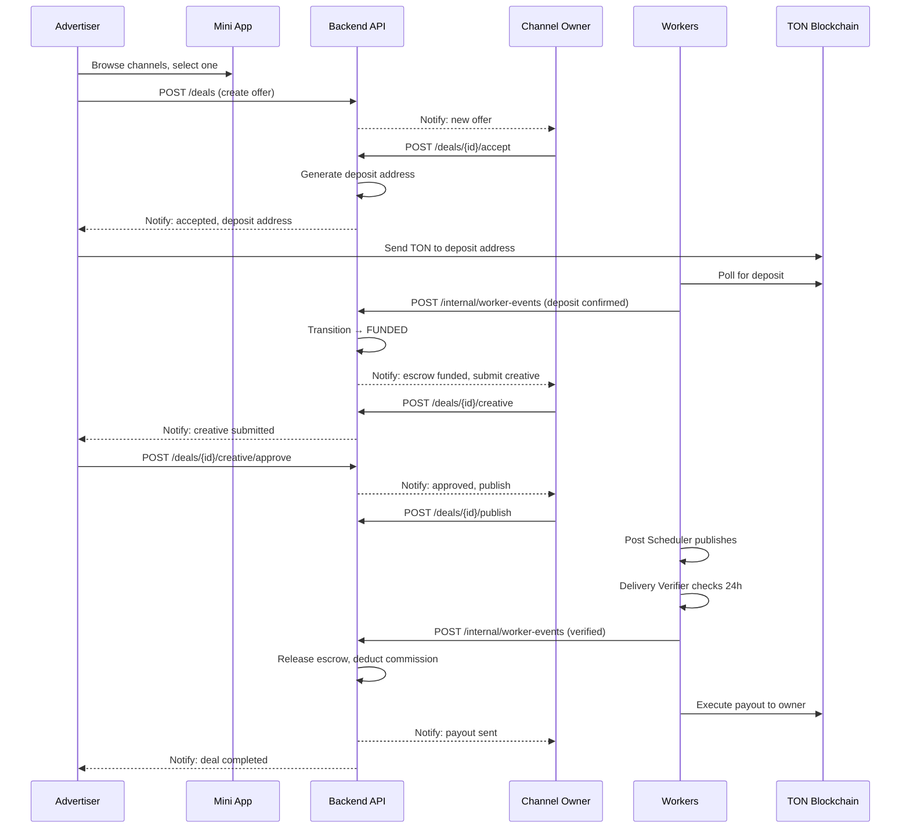

# Feature: Deal Lifecycle

## Overview

A deal represents a single advertising agreement between an Advertiser and a Channel Owner. It is the central aggregate of the system, governed by a state machine with 17 states and multiple transition paths.

## Lifecycle Sequence

## Deal Aggregate

The `deals` table is the primary aggregate:

| Field | Type | Description |
|-------|------|-------------|
| `id` | `UUID` | Deal identifier |
| `advertiser_id` | `BIGINT` | Telegram user ID |
| `channel_id` | `BIGINT` | Target channel |
| `owner_id` | `BIGINT` | Channel owner user ID |
| `status` | `VARCHAR` | Current state (see [State Machine](../06-deal-state-machine.md)) |
| `version` | `INTEGER` | Optimistic locking counter for concurrent transition safety |
| `amount_nano` | `BIGINT` | Agreed deal amount in nanoTON |
| `deposit_address` | `VARCHAR` | Generated TON deposit address |
| `deposit_tx_hash` | `VARCHAR` | Deposit transaction hash |
| `funded_at` | `TIMESTAMPTZ` | When escrow was funded |
| `payout_tx_hash` | `VARCHAR` | Payout transaction hash |
| `refunded_tx_hash` | `VARCHAR` | Refund transaction hash (if applicable) |
| `creative_brief` | `JSONB` | Advertiser's creative requirements |
| `creative_draft` | `JSONB` | Channel owner's creative submission |
| `scheduled_at` | `TIMESTAMPTZ` | Scheduled publication time |
| `published_at` | `TIMESTAMPTZ` | Actual publication time |
| `created_at` | `TIMESTAMPTZ` | Deal creation timestamp |
| `updated_at` | `TIMESTAMPTZ` | Last update timestamp |
| `deadline_at` | `TIMESTAMPTZ` | Current state's deadline |

## State Transitions

See [Deal State Machine](../06-deal-state-machine.md) for the complete state diagram, transition rules, timeouts, and event storage.

## API Endpoints

| Method | Path | Description |
|--------|------|-------------|
| `POST` | `/api/v1/deals` | Create deal offer |
| `GET` | `/api/v1/deals/{id}` | Get deal details |
| `GET` | `/api/v1/deals` | List deals (filtered by role) |
| `POST` | `/api/v1/deals/{id}/accept` | Accept offer |
| `POST` | `/api/v1/deals/{id}/reject` | Reject offer |
| `POST` | `/api/v1/deals/{id}/negotiate` | Submit counter-offer |
| `POST` | `/api/v1/deals/{id}/cancel` | Cancel deal |
| `GET` | `/api/v1/deals/{id}/timeline` | Get deal event timeline |
| `GET` | `/api/v1/deals/{id}/deposit` | Get deposit address and status |

## Components Involved

| Component | Role |
|-----------|------|
| **Deal Flow UI** | Deal timeline, status transitions via MainButton |
| **Deal Controller** | REST endpoints for deal CRUD and transitions |
| **Deal Transition Service** | State machine transitions with actor checks |
| **Deal Workflow Engine** | Lifecycle orchestration, side-effects, timeout scheduling |
| **Outbox Publisher** | Publishes deal events to Kafka |

## Related Documents

- [Deal State Machine](../06-deal-state-machine.md)
- [Creative Workflow](./03-creative-workflow.md)
- [Escrow Payments](./04-escrow-payments.md)
- [Delivery Verification](./05-delivery-verification.md)
- [Dispute Resolution](./06-dispute-resolution.md)
