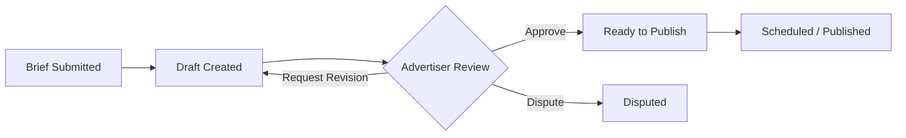

# Feature: Creative Workflow

## Overview

The creative workflow manages the content approval process between advertiser and channel owner. It ensures both parties agree on the advertising content before it is published, with a structured brief → draft → review → approval cycle.

## Workflow Stages

### 1. Brief Submission

The advertiser provides a creative brief when creating or after accepting a deal:

| Brief Field | Type | Description |
|-------------|------|-------------|
| `headline` | `VARCHAR` | Suggested headline or topic |
| `body_requirements` | `TEXT` | Content requirements and guidelines |
| `cta` | `VARCHAR` | Call-to-action text and link |
| `media` | `JSONB` | Image/video requirements or provided assets |
| `tone` | `VARCHAR` | Desired tone (professional, casual, etc.) |
| `restrictions` | `TEXT` | What NOT to include |
| `reference_links` | `JSONB` | Example posts or reference materials |

The brief is stored in `deals.creative_brief` as JSONB.

### 2. Draft Creation

The channel owner (or admin with `moderate` right) creates a draft based on the brief:

| Draft Field | Type | Description |
|-------------|------|-------------|
| `text` | `TEXT` | Post text content (with markdown/HTML) |
| `media_urls` | `JSONB` | Attached images/videos |
| `buttons` | `JSONB` | Inline keyboard buttons (optional) |
| `preview_link` | `BOOLEAN` | Whether to show link preview |
| `version` | `INTEGER` | Draft version number |
| `submitted_at` | `TIMESTAMPTZ` | Submission timestamp |

The draft is stored in `deals.creative_draft` as JSONB. Each revision increments the version.

### 3. Advertiser Review

The advertiser reviews the draft and can:

- **Approve** — transitions deal to `CREATIVE_APPROVED`
- **Request revision** — transitions deal back to `FUNDED`, owner creates new draft version
- **Dispute** — transitions deal to `DISPUTED` (if creative quality is unacceptable)

### 4. Publication

After approval, the channel owner chooses:

- **Publish immediately** — Post Scheduler publishes right away
- **Schedule** — Set a future `scheduled_at` timestamp for auto-publication

## API Endpoints

| Method | Path | Description |
|--------|------|-------------|
| `POST` | `/api/v1/deals/{id}/brief` | Submit creative brief |
| `GET` | `/api/v1/deals/{id}/brief` | Get creative brief |
| `POST` | `/api/v1/deals/{id}/creative` | Submit creative draft |
| `GET` | `/api/v1/deals/{id}/creative` | Get current draft |
| `GET` | `/api/v1/deals/{id}/creative/history` | Get all draft versions |
| `POST` | `/api/v1/deals/{id}/creative/approve` | Approve creative |
| `POST` | `/api/v1/deals/{id}/creative/revision` | Request revision |
| `POST` | `/api/v1/deals/{id}/publish` | Trigger publication |
| `POST` | `/api/v1/deals/{id}/schedule` | Schedule publication |

## Components Involved

| Component | Role |
|-----------|------|
| **Deal Flow UI** | Brief form, draft preview, review interface |
| **Deal Controller** | Creative-related REST endpoints |
| **Deal Transition Service** | State transitions for creative stages |
| **Post Scheduler** | Auto-publishes at `scheduled_at` via Telegram Bot API |

## Authorization

| Action | Advertiser | Channel Owner | Channel Admin |
|--------|:---:|:---:|:---:|
| Submit brief | Y | - | - |
| Submit draft | - | Y | `moderate` right |
| Review/approve | Y | - | - |
| Publish | - | Y | `publish` right |
| Schedule | - | Y | `publish` right |

## Related Documents

- [Deal Lifecycle](./02-deal-lifecycle.md)
- [Deal State Machine](../06-deal-state-machine.md) — creative-related states
- [Delivery Verification](./05-delivery-verification.md) — what happens after publication
- [Team Management](./07-team-management.md) — admin rights for creative
