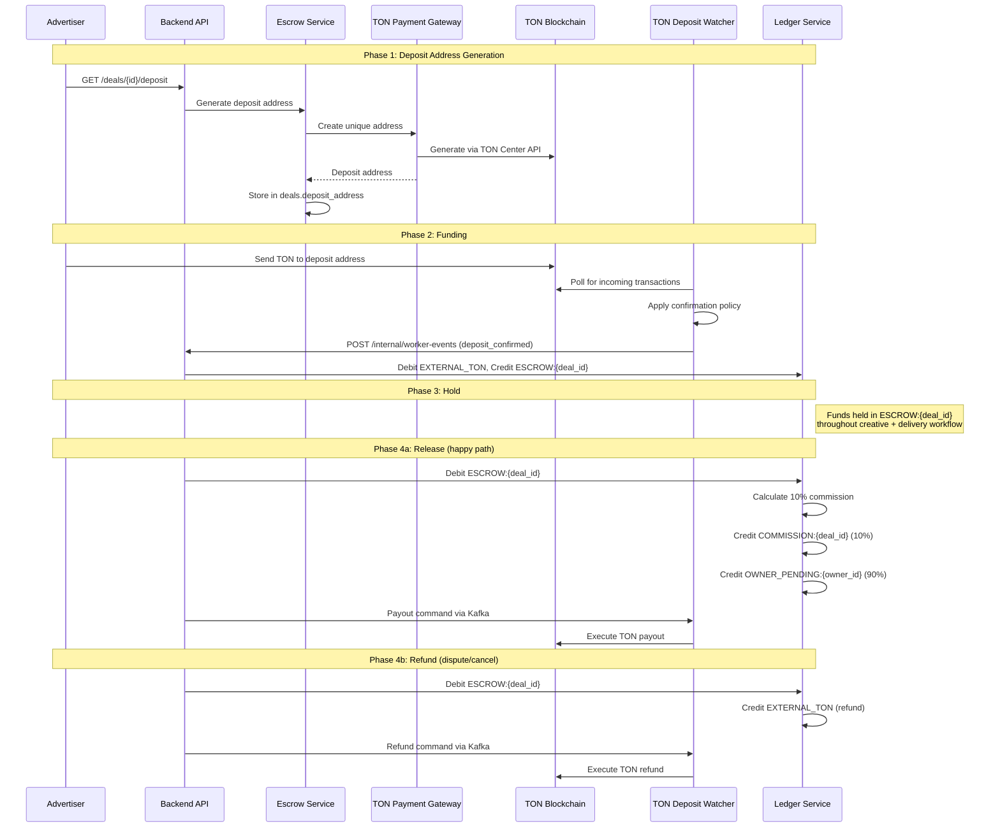

# Feature: Escrow Payments

## Overview

The escrow system holds advertiser funds in a platform-controlled account until delivery conditions are met. This is the core trust mechanism — advertisers know their money is safe, and channel owners know they will be paid for verified delivery.

## Escrow Lifecycle

## Deposit Flow

1. **Address generation** — Escrow Service requests unique deposit address from TON Payment Gateway
2. **QR display** — Mini App shows deposit address as QR code with expected amount
3. **Payment monitoring** — TON Deposit Watcher polls TON Center API for incoming transactions
4. **Confirmation** — Tiered confirmation policy applied (see [Confirmation Policy](../07-financial-system/06-confirmation-policy.md))
5. **Ledger recording** — Double-entry: debit `EXTERNAL_TON`, credit `ESCROW:{deal_id}`
6. **State transition** — Deal moves to `FUNDED`

## Release Flow

Triggered when delivery verification passes:

1. Commission calculated (10% default via Commission Service)
2. Ledger entries:
   - Debit `ESCROW:{deal_id}` — full amount
   - Credit `COMMISSION:{deal_id}` — 10%
   - Credit `OWNER_PENDING:{owner_id}` — 90%
3. Payout command published to `escrow.commands` Kafka topic
4. Payout Executor submits TON transaction
5. Deal transitions to `COMPLETED_RELEASED`

## Refund Flow

Triggered by dispute resolution or cancellation:

1. Ledger entries:
   - Debit `ESCROW:{deal_id}` — full amount
   - Credit `EXTERNAL_TON` — refund
2. Refund command published to `escrow.commands` Kafka topic
3. Refund Executor submits TON refund transaction
4. Deal transitions to `REFUNDED`

## Idempotency

All escrow operations are idempotent:

- **Deposit detection** — `ton_transactions.tx_hash` is the primary key, duplicate deposits are ignored
- **Payout/Refund execution** — Redis distributed locks prevent double execution
- **Worker callbacks** — Idempotency key in callback payload, checked before processing

## API Endpoints

| Method | Path | Description |
|--------|------|-------------|
| `GET` | `/api/v1/deals/{id}/deposit` | Get deposit address, QR code, payment status |
| `GET` | `/api/v1/deals/{id}/escrow` | Get escrow status and balance |

## Components Involved

| Component | Role |
|-----------|------|
| **Escrow UI** | Deposit address display, QR code, payment status tracker |
| **Escrow Service** | Deposit address generation, hold, release, refund orchestration |
| **TON Payment Gateway** | TON blockchain abstraction: address gen, tx submit |
| **Confirmation Policy** | Tiered confirmation requirements |
| **Ledger Service** | Double-entry recording for all money movement |
| **Commission Service** | 10% commission calculation |
| **TON Deposit Watcher** | Poll for deposits, apply confirmation policy |
| **Payout Executor** | Execute TON payouts |
| **Refund Executor** | Execute TON refunds |

## Related Documents

- [Deal State Machine](../06-deal-state-machine.md) — payment-related transitions
- [Escrow Flow (Financial)](../07-financial-system/02-escrow-flow.md) — detailed ledger mechanics
- [Commission Model](../07-financial-system/03-commission-model.md)
- [Confirmation Policy](../07-financial-system/06-confirmation-policy.md)
- [Double-Entry Ledger](../05-patterns-and-decisions/05-double-entry-ledger.md)
