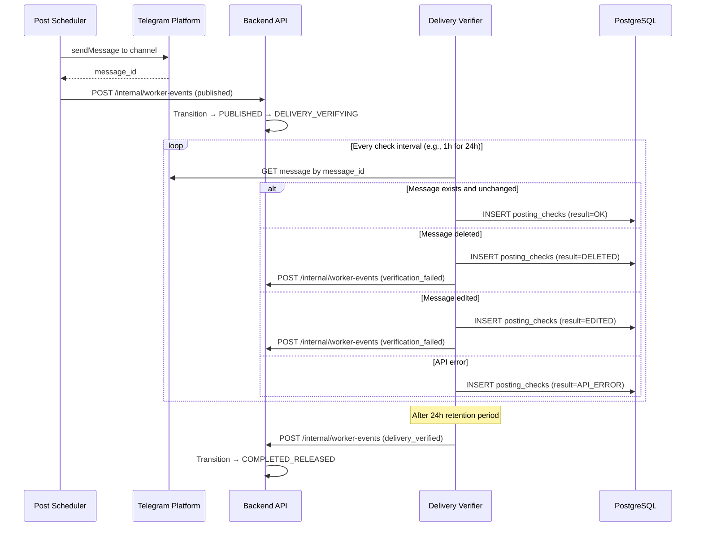

# Feature: Delivery Verification

## Overview

Delivery verification ensures that the advertiser's approved creative was actually published to the Telegram channel and retained for the agreed duration (24 hours minimum). This is the automated trust mechanism that triggers escrow release.

## Verification Flow

## Auto-Posting

The **Post Scheduler** worker handles publication:

1. Consumes `delivery.commands` Kafka topic
2. At `scheduled_at` time (or immediately if no schedule), calls Telegram Bot API `sendMessage`
3. Records the resulting `message_id` in the deal
4. Reports publication result via Worker Callback Controller

### Post Content

The published message includes:

- Creative text from `deals.creative_draft`
- Media attachments (images/videos)
- Inline keyboard buttons (if specified)
- Link preview settings

## Verification Checks

The **Delivery Verifier** worker performs periodic checks:

| Check | Method | Result |
|-------|--------|--------|
| Post exists | `getMessages` by `message_id` | `OK` or `DELETED` |
| Content intact | Compare text hash with original | `OK` or `EDITED` |
| Media intact | Verify media presence | `OK` or `EDITED` |

### Check Schedule

- First check: immediately after publication
- Subsequent checks: every 1 hour for 24 hours
- Total checks: ~24 per deal

### posting_checks Table

| Column | Type | Description |
|--------|------|-------------|
| `id` | `UUID` | Check record ID |
| `deal_id` | `UUID` | Deal reference |
| `message_id` | `BIGINT` | Telegram message ID |
| `result` | `VARCHAR` | `OK`, `DELETED`, `EDITED`, `API_ERROR` |
| `checked_at` | `TIMESTAMPTZ` | Check timestamp |
| `details` | `JSONB` | Additional check metadata |

Table is **partitioned by `checked_at`** for efficient range queries.

## Verification Outcomes

| Outcome | Condition | Action |
|---------|-----------|--------|
| **PASS** | All checks OK for 24h | Transition to `COMPLETED_RELEASED`, release escrow |
| **FAIL — Deleted** | Post deleted before 24h | Transition to `DISPUTED`, freeze escrow |
| **FAIL — Edited** | Post content modified | Transition to `DISPUTED`, freeze escrow |
| **TIMEOUT** | 24h elapsed, no failures | Auto-approve (transition to `COMPLETED_RELEASED`) |

## Components Involved

| Component | Role |
|-----------|------|
| **Post Scheduler** | Publishes creative to Telegram channel at scheduled time |
| **Delivery Verifier** | Periodic integrity checks over 24h retention period |
| **Worker Callback Controller** | Receives publication and verification results |
| **Deal Transition Service** | State transitions based on verification outcome |
| **Telegram Platform** | Bot API for posting and message verification |

## Kafka Topics

| Topic | Producer | Consumer | Purpose |
|-------|----------|----------|---------|
| `delivery.commands` | Outbox Publisher | Post Scheduler, Delivery Verifier | Publication and verification commands |
| `delivery.results` | Delivery Verifier | Backend API (via callback) | Verification results |

## Related Documents

- [Deal Lifecycle](./02-deal-lifecycle.md)
- [Deal State Machine](../06-deal-state-machine.md) — delivery-related transitions
- [Dispute Resolution](./06-dispute-resolution.md) — what happens on verification failure
- [Workers](../04-architecture/04-workers.md) — Post Scheduler and Delivery Verifier details
