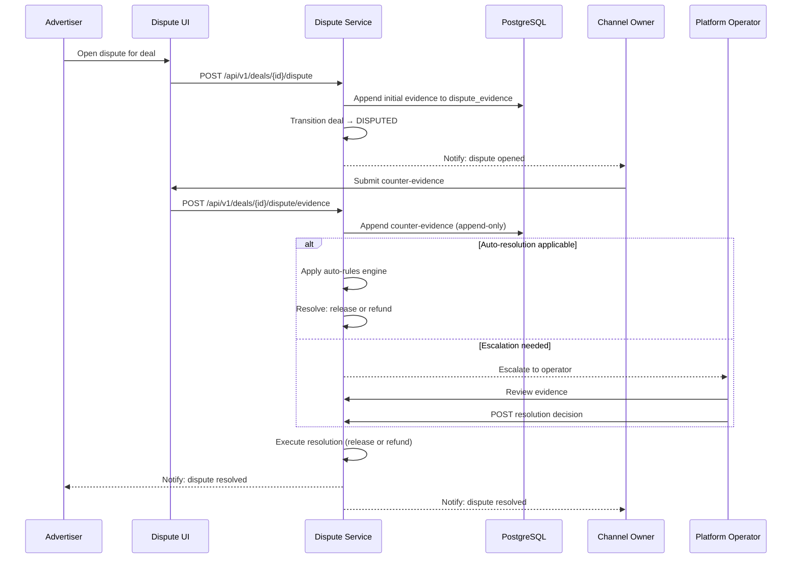

# Feature: Dispute Resolution

## Overview

The dispute resolution system handles conflicts between advertisers and channel owners. It combines automated rules for clear-cut cases with human operator escalation for complex disputes.

## Dispute Flow

## Dispute Triggers

| Trigger | Who | From State |
|---------|-----|-----------|
| Creative quality unacceptable | Advertiser | `CREATIVE_SUBMITTED` |
| Post deleted before 24h | System (Delivery Verifier) | `DELIVERY_VERIFYING` |
| Post content edited | System (Delivery Verifier) | `DELIVERY_VERIFYING` |
| Manual dispute filing | Advertiser or Channel Owner | Various funded states |

## Evidence Collection

Evidence is stored in `dispute_evidence` — an **append-only** event store:

| Column | Type | Description |
|--------|------|-------------|
| `id` | `UUID` | Evidence record ID |
| `deal_id` | `UUID` | Deal reference |
| `submitted_by` | `BIGINT` | User who submitted |
| `evidence_type` | `VARCHAR` | `SCREENSHOT`, `TEXT`, `LINK`, `SYSTEM_CHECK` |
| `content` | `JSONB` | Evidence payload |
| `content_hash` | `VARCHAR` | SHA-256 hash for integrity |
| `created_at` | `TIMESTAMPTZ` | Submission timestamp |

Evidence records are **immutable** — once submitted, they cannot be modified or deleted.

## Auto-Resolution Rules

The Dispute Service applies automated rules for clear-cut cases:

| Rule | Condition | Resolution |
|------|-----------|------------|
| **Post deleted** | Delivery Verifier detected deletion within 24h | Refund to advertiser |
| **Post edited** | Content hash mismatch detected | Refund to advertiser |
| **No creative submitted** | Creative timeout expired in FUNDED state | Refund to advertiser |
| **Timeout** | Dispute unresolved after configurable period | Escalate to operator |

## Operator Escalation

When auto-rules cannot resolve, the dispute is escalated to a Platform Operator:

1. Operator receives notification via Telegram Bot
2. Reviews all evidence from both parties
3. Reviews deal timeline and verification checks
4. Makes resolution decision: **release** (to owner) or **refund** (to advertiser)
5. Resolution is recorded in `audit_log` with operator's decision and reasoning

## Resolution Outcomes

| Outcome | Ledger Action | Deal State |
|---------|--------------|------------|
| **Release to owner** | Debit `ESCROW:{deal_id}`, credit `COMMISSION` + `OWNER_PENDING` | `COMPLETED_RELEASED` |
| **Refund to advertiser** | Debit `ESCROW:{deal_id}`, credit `EXTERNAL_TON` | `REFUNDED` |
| **Partial refund** | Split between owner and advertiser (future feature) | — |

## API Endpoints

| Method | Path | Description |
|--------|------|-------------|
| `POST` | `/api/v1/deals/{id}/dispute` | Open dispute |
| `POST` | `/api/v1/deals/{id}/dispute/evidence` | Submit evidence |
| `GET` | `/api/v1/deals/{id}/dispute` | Get dispute status and evidence |
| `POST` | `/api/v1/deals/{id}/dispute/resolve` | Resolve dispute (operator only) |

## Components Involved

| Component | Role |
|-----------|------|
| **Dispute UI** | Dispute filing form, evidence upload, resolution status |
| **Dispute Service** | Hybrid resolution: auto-rules + operator escalation |
| **Deal Transition Service** | State transitions for dispute outcomes |
| **Deal Workflow Engine** | Execute release or refund side-effects |
| **Ledger Service** | Record resolution financial entries |
| **dispute_evidence** | Append-only evidence storage |
| **audit_log** | WORM audit trail for resolution decisions |

## Related Documents

- [Deal State Machine](../06-deal-state-machine.md) — dispute-related transitions
- [Delivery Verification](./05-delivery-verification.md) — auto-triggered disputes
- [Escrow Payments](./04-escrow-payments.md) — release/refund mechanics
- [Security & Compliance](../10-security-and-compliance.md) — evidence integrity
