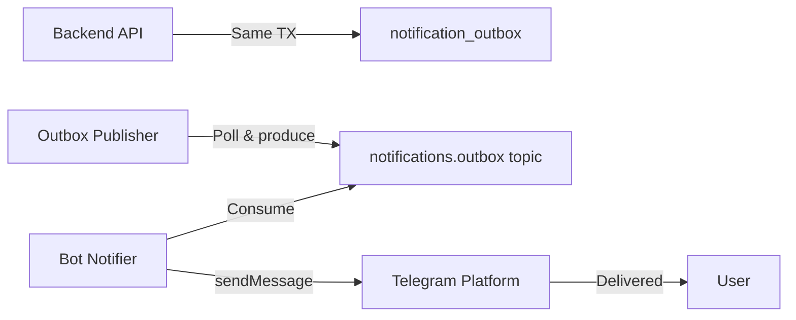

# Feature: Notifications

## Overview

The notification system delivers real-time updates to users about deal progress, payment status, disputes, and other platform events. It uses a Kafka-based pipeline with transactional outbox pattern for reliable delivery via the Telegram Bot.

## Notification Pipeline

### Pipeline Steps

1. **Domain event occurs** — deal transition, payment confirmed, dispute filed, etc.
2. **Outbox write** — notification record written to `notification_outbox` table within the same database transaction as the domain operation (transactional outbox pattern)
3. **Outbox polling** — Outbox Publisher reads `PENDING` notifications and produces to `notifications.outbox` Kafka topic
4. **Bot consumption** — Bot Notifier consumes from Kafka topic
5. **Telegram delivery** — Bot Notifier sends message via Telegram Bot API `sendMessage`
6. **Status update** — notification status updated: `PENDING` → `PROCESSING` → `DELIVERED` / `FAILED`

## Notification Types

| Event | Recipients | Message Content |
|-------|-----------|----------------|
| **New offer** | Channel Owner | "New ad offer for {channel}: {amount} TON" |
| **Offer accepted** | Advertiser | "Your offer accepted. Deposit {amount} TON to proceed." |
| **Offer rejected** | Advertiser | "Your offer was declined." |
| **Escrow funded** | Channel Owner | "Escrow funded for deal #{id}. Please submit creative." |
| **Creative submitted** | Advertiser | "Creative draft ready for review." |
| **Creative approved** | Channel Owner | "Creative approved! Publish when ready." |
| **Revision requested** | Channel Owner | "Advertiser requested creative revision." |
| **Published** | Advertiser | "Ad published in {channel}. Verification started." |
| **Delivery verified** | Both | "Delivery verified. Payout processing." |
| **Payout sent** | Channel Owner | "Payout of {amount} TON sent. TX: {hash}" |
| **Dispute opened** | Both | "Dispute opened for deal #{id}." |
| **Dispute resolved** | Both | "Dispute resolved: {outcome}." |
| **Deal expired** | Both | "Deal #{id} expired." |
| **Deal cancelled** | Other party | "Deal #{id} cancelled." |
| **Reconciliation alert** | Platform Operator | "Reconciliation discrepancy detected." |
| **Bot removed from channel** | Channel Owner | "Bot removed from {channel}. Channel deactivated." |
| **Bot demoted in channel** | Channel Owner | "Bot lost admin rights in {channel}. Channel deactivated." |
| **Bot restored as admin** | Channel Owner | "Bot restored in {channel}. Channel activated." |

## notification_outbox Table

| Column | Type | Description |
|--------|------|-------------|
| `id` | `UUID` | Notification ID |
| `idempotency_key` | `VARCHAR` | Unique key for deduplication |
| `recipient_id` | `BIGINT` | Telegram user ID |
| `event_type` | `VARCHAR` | Notification type |
| `payload` | `JSONB` | Message template data |
| `status` | `VARCHAR` | `PENDING`, `PROCESSING`, `DELIVERED`, `FAILED` |
| `retry_count` | `INTEGER` | Number of delivery attempts |
| `created_at` | `TIMESTAMPTZ` | Creation timestamp |
| `processed_at` | `TIMESTAMPTZ` | When processing started |
| `delivered_at` | `TIMESTAMPTZ` | When delivery confirmed |

## Delivery Guarantees

- **At-least-once** — Kafka consumer with manual offset commit ensures no messages are lost
- **Idempotency** — `idempotency_key` prevents duplicate notifications
- **Retry** — Failed deliveries are retried with exponential backoff (max 3 retries)
- **Dead letter** — Permanently failed notifications are logged for manual review

## Components Involved

| Component | Role |
|-----------|------|
| **Outbox Publisher** | Polls `notification_outbox`, produces to Kafka |
| **Bot Notifier** | Consumes notifications, dispatches via Telegram Bot API |
| **Bot Command Router** | Handles `/start`, `/language`, inline keyboard actions |
| **notification_outbox** | Transactional outbox table |
| **notifications.outbox** | Kafka topic for notification events |

## Kafka Topic

| Topic | Partitions | Key | Producer | Consumer |
|-------|-----------|-----|----------|----------|
| `notifications.outbox` | by user_id | `recipient_id` | Outbox Publisher | Bot Notifier |

## Related Documents

- [Transactional Outbox Pattern](../05-patterns-and-decisions/03-transactional-outbox.md)
- [Kafka Topology](../04-architecture/06-kafka-topology.md)
- [Workers](../04-architecture/04-workers.md) — Bot Notifier details
