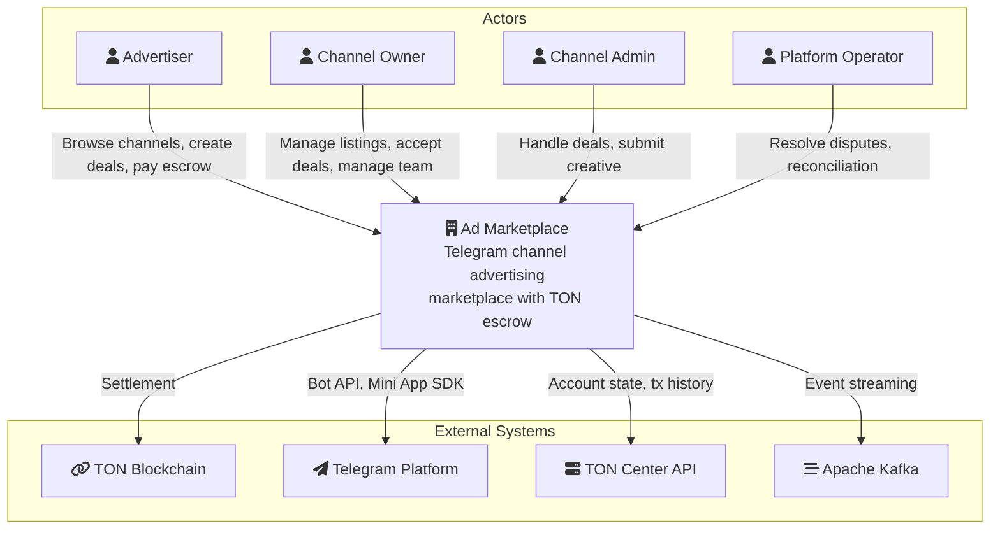

# Architecture: System Landscape (C4 Level 1)

## Overview

The Ad Marketplace system landscape shows the platform, its 4 actors, and 4 external dependencies.

## Landscape Diagram

## Actors

| Actor | Entry Point | Primary Actions |
|-------|-------------|-----------------|
| **Advertiser** | Mini App | Browse channels, create deals, pay escrow |
| **Channel Owner** | Mini App | Manage listings, accept deals, manage team |
| **Channel Admin** | Mini App | Handle deals, submit creative (delegated rights) |
| **Platform Operator** | Backend API (direct) | Resolve disputes, review high-value tx, reconciliation |

See [Actors and Personas](../02-actors-and-personas.md) for detailed capabilities.

## External Systems

### TON Blockchain

- **Type**: External system, tagged `#blockchain`
- **Role**: Custodial deposit/payout settlement
- **Interactions**: Advertiser sends TON to deposit address; platform sends payouts/refunds

### Telegram Platform

- **Type**: External system
- **Role**: User identity, notifications, inline UI
- **Services used**: Bot API (webhooks, sendMessage), Mini App SDK (WebApp context, initData)

### TON Center API

- **Type**: External system, tagged `#blockchain`
- **Role**: TON HTTP API provider
- **Services used**: Account state queries, transaction history, transaction broadcast
- **Consumers**: TON Payment Gateway, TON Deposit Watcher, Payout Executor, Refund Executor

### Apache Kafka

- **Type**: External system (managed cluster)
- **Role**: Event streaming, worker queues, Schema Registry
- **Configuration**: Partitioned by `deal_id` for ordering guarantees

## System Boundary

The **Ad Marketplace** system boundary contains:

- 1 reverse proxy (Nginx — TLS, blue-green)
- 1 frontend container (Mini App)
- 1 backend container (Backend API — Java 25 + Spring Boot 4)
- 1 bot container (Telegram Bot)
- 1 worker container (Workers — 7 Kafka consumers)
- 1 database (PostgreSQL 18 — 20 base tables, partitioned)
- 1 message broker (Kafka 4.1 KRaft — 8 topics)
- 1 cache (Redis 8.4 — balance cache, distributed locks, canary config)

See [Containers](./02-containers.md) for C4 Level 2 detail.

## Related Documents

- [Containers](./02-containers.md) — C4 Level 2
- [Actors and Personas](../02-actors-and-personas.md)
- [Tech Stack](../08-tech-stack.md)
