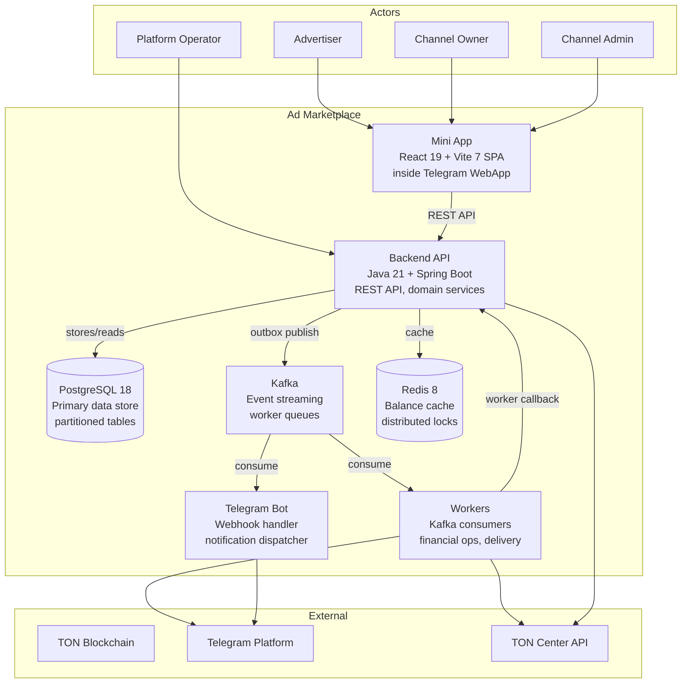

# Architecture: Containers (C4 Level 2)

## Overview

The Ad Marketplace consists of 7 containers that work together to deliver the marketplace functionality.

## Container Diagram

## Container Details

### 1. Mini App

| Attribute | Value |
|-----------|-------|
| **Technology** | React 19 + Vite 7 SPA |
| **Runtime** | Inside Telegram WebApp (browser) |
| **Tags** | `#mvp` |
| **Components** | Escrow UI, Deal Flow UI, Dispute UI, Team Management UI |

Communicates with Backend API via synchronous REST calls.

### 2. Backend API

| Attribute | Value |
|-----------|-------|
| **Technology** | Java 21 + Spring Boot 4.0 |
| **Tags** | `#mvp` |
| **Components** | 16+ services (see [Backend API Components](./03-backend-api-components.md)) |

The central orchestrator — handles REST endpoints, domain logic, financial core, and worker coordination.

### 3. Telegram Bot

| Attribute | Value |
|-----------|-------|
| **Technology** | Bot webhook handler |
| **Tags** | `#mvp` |
| **Components** | Bot Notifier, Bot Command Router |

Handles notifications pipeline and basic bot commands (`/start`, `/language`).

### 4. Workers

| Attribute | Value |
|-----------|-------|
| **Technology** | Kafka consumers |
| **Tags** | `#mvp` |
| **Components** | 7 workers (see [Workers](./04-workers.md)) |

Async processors for financial operations, delivery verification, timeouts, and reconciliation.

### 5. PostgreSQL

| Attribute | Value |
|-----------|-------|
| **Technology** | PostgreSQL 18 |
| **Tags** | `#mvp` |
| **Tables** | 12+ tables (see [Data Stores](./05-data-stores.md)) |

Primary data store with partitioned tables for events and verification checks.

### 6. Kafka

| Attribute | Value |
|-----------|-------|
| **Technology** | Apache Kafka 4.1 (KRaft) |
| **Topics** | 8 topics (see [Kafka Topology](./06-kafka-topology.md)) |

Event streaming and worker command/result queues. Partitioned by `deal_id`.

### 7. Redis

| Attribute | Value |
|-----------|-------|
| **Technology** | Redis 8 |
| **Tags** | `#mvp` |
| **Components** | Balance Cache, Distributed Locks |

See [Redis Usage](./07-redis-usage.md).

## Inter-Container Communication

| From | To | Protocol | Description |
|------|----|----------|-------------|
| Mini App | Backend API | Sync REST (HTTPS) | All user-facing operations |
| Backend API | PostgreSQL | JDBC | Data persistence |
| Backend API | Redis | Redis protocol | Cache reads/writes, lock acquisition |
| Backend API | Kafka | Produce (via Outbox) | Domain events, commands |
| Kafka | Workers | Consume | Async processing commands |
| Kafka | Telegram Bot | Consume | Notification events |
| Workers | Backend API | Sync REST (internal) | Worker callback results |
| Workers | TON Center API | HTTPS | Blockchain operations |
| Workers | Telegram Platform | HTTPS | Post scheduling, verification |
| Telegram Bot | Telegram Platform | HTTPS | Notification delivery |
| Backend API | TON Center API | HTTPS | Address generation, balance check |

## Related Documents

- [Backend API Components](./03-backend-api-components.md) — C4 Level 3
- [Workers](./04-workers.md) — 7 async workers
- [Data Stores](./05-data-stores.md) — PostgreSQL tables
- [Kafka Topology](./06-kafka-topology.md)
- [Redis Usage](./07-redis-usage.md)
- [Deployment](../09-deployment.md) — MVP and Scaled topologies
