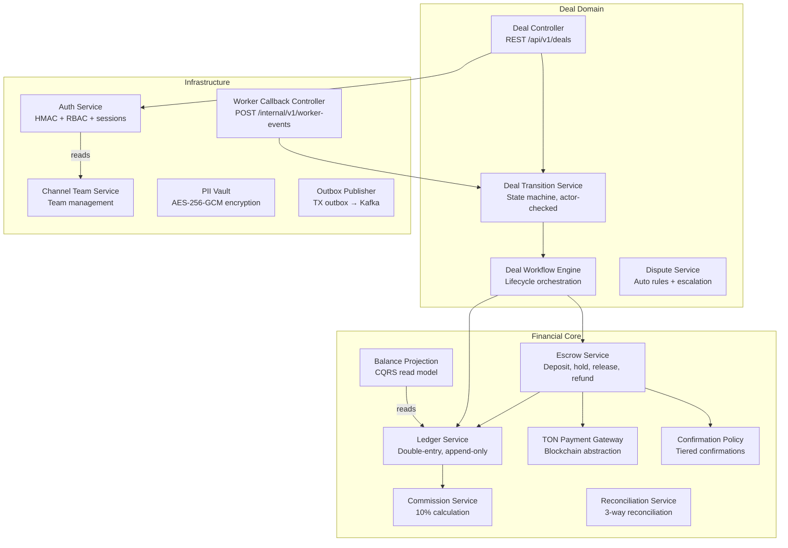

# Architecture: Backend API Components (C4 Level 3)

## Overview

The Backend API container (Java 21 + Spring Boot) contains 16+ services organized into three concern groups: Deal Domain, Financial Core, and Infrastructure.

## Component Map

## Deal Domain Services

### Deal Controller

| Attribute | Value |
|-----------|-------|
| **Type** | Component (REST Controller) |
| **Endpoints** | `/api/v1/deals` — CRUD, transitions, offers |
| **Depends on** | Deal Transition Service, Auth Service |

### Deal Transition Service

| Attribute | Value |
|-----------|-------|
| **Type** | Service |
| **Tags** | `#idempotent` |
| **Role** | State machine transitions: actor-checked, idempotent, event-emitting |
| **Stores to** | `deals` (status update), `deal_events` (append transition event) |
| **Called by** | Deal Controller, Worker Callback Controller |

### Deal Workflow Engine

| Attribute | Value |
|-----------|-------|
| **Type** | Service |
| **Role** | Lifecycle orchestration: deadlines, side-effects, timeout scheduling |
| **Depends on** | Escrow Service, Ledger Service |

### Dispute Service

| Attribute | Value |
|-----------|-------|
| **Type** | Service |
| **Role** | Hybrid dispute resolution: auto rules engine + operator escalation |
| **Stores to** | `dispute_evidence` (append evidence) |
| **Depends on** | Deal Transition Service, Deal Workflow Engine, Ledger Service |

## Financial Core Services

### Ledger Service

| Attribute | Value |
|-----------|-------|
| **Type** | Service |
| **Tags** | `#financial`, `#cqrs-write`, `#immutable`, `#critical` |
| **Role** | Double-entry append-only ledger — source of truth for all money movement |
| **Stores to** | `ledger_entries` (double-entry record), `audit_log` (audit trail) |
| **Depends on** | Commission Service |

### Balance Projection

| Attribute | Value |
|-----------|-------|
| **Type** | Service |
| **Tags** | `#financial`, `#cqrs-read` |
| **Role** | CQRS read model — materialized from ledger events, cached in Redis |
| **Reads** | `ledger_entries` |
| **Stores to** | `account_balances` (materialized view), Redis Balance Cache |

### Escrow Service

| Attribute | Value |
|-----------|-------|
| **Type** | Service |
| **Tags** | `#financial`, `#custodial`, `#idempotent` |
| **Role** | Deposit address generation, funding confirmation, hold, release, refund |
| **Depends on** | TON Payment Gateway, Confirmation Policy, Ledger Service |
| **Uses** | Redis Distributed Locks (escrow deduplication) |

### Commission Service

| Attribute | Value |
|-----------|-------|
| **Type** | Service |
| **Tags** | `#financial` |
| **Role** | Platform commission calculation (10% default, segment-configurable) |

### Reconciliation Service

| Attribute | Value |
|-----------|-------|
| **Type** | Service |
| **Tags** | `#financial`, `#audit` |
| **Role** | Ledger vs blockchain vs deal aggregate reconciliation |
| **Reads** | `ledger_entries`, `ton_transactions`, `deals` |

### TON Payment Gateway

| Attribute | Value |
|-----------|-------|
| **Type** | Service |
| **Tags** | `#financial`, `#blockchain` |
| **Role** | TON blockchain abstraction: address gen, tx submit, confirmation tracking |
| **Stores to** | `ton_transactions` |
| **External** | TON Center API |

### Confirmation Policy

| Attribute | Value |
|-----------|-------|
| **Type** | Service |
| **Tags** | `#financial` |
| **Role** | Tiered confirmation: <=100 TON → 1 conf, <=1000 TON → 3, >1000 TON → 5 + operator review |

## Infrastructure Services

### Auth Service

| Attribute | Value |
|-----------|-------|
| **Type** | Service |
| **Tags** | `#mvp` |
| **Role** | Telegram initData HMAC + anti-replay + session tokens + ABAC policy evaluation (contextual roles) |
| **Reads** | `channel_memberships` |

### Channel Team Service

| Attribute | Value |
|-----------|-------|
| **Type** | Service |
| **Role** | Channel team management: invite, rights delegation, revocation |
| **Stores to** | `channel_memberships` |

### PII Vault

| Attribute | Value |
|-----------|-------|
| **Type** | Service |
| **Tags** | `#pii` |
| **Role** | Isolated PII storage with AES-256-GCM field-level encryption |
| **Stores to** | `pii_store` |

### Outbox Publisher

| Attribute | Value |
|-----------|-------|
| **Type** | Service |
| **Tags** | `#outbox` |
| **Role** | Transactional outbox to Kafka producer (Debezium CDC or direct produce) |
| **Reads** | `notification_outbox` |
| **Produces to** | `deal.events`, `escrow.commands`, `delivery.commands`, `notifications.outbox`, `deal.deadlines` |

### Worker Callback Controller

| Attribute | Value |
|-----------|-------|
| **Type** | Component (REST Controller) |
| **Tags** | `#internal-only`, `#worker-callback` |
| **Endpoint** | `POST /internal/v1/worker-events` |
| **Role** | Receives results from workers: deposit confirmed, payout sent, etc. |
| **Depends on** | Deal Transition Service |

## Related Documents

- [Containers](./02-containers.md) — C4 Level 2
- [Workers](./04-workers.md) — async processors that call back to Backend API
- [Data Stores](./05-data-stores.md) — tables used by services
- [Patterns & Decisions](../05-patterns-and-decisions/) — architectural patterns used
