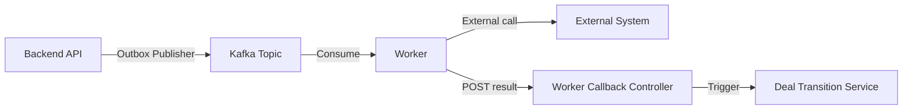

# Architecture: Workers

## Overview

The Workers container hosts 7 async processors that consume Kafka messages and perform background operations. All workers follow the **callback pattern**: after completing their task, they report results back to the Backend API via the Worker Callback Controller (`POST /internal/v1/worker-events`).

## Worker Callback Pattern

All workers:
1. Consume from a specific Kafka topic
2. Perform the operation (blockchain call, Telegram API call, etc.)
3. Report result back to Backend API via internal REST endpoint
4. Backend API processes the result and triggers state transitions

## Workers

### 1. TON Deposit Watcher

| Attribute | Value |
|-----------|-------|
| **Tags** | `#financial`, `#blockchain` |
| **Consumes** | `escrow.commands` |
| **Produces** | `escrow.confirmations` |
| **External** | TON Center API (`GET account transactions`) |
| **Callback** | `POST deposit confirmed (tx_hash, amount)` |

Polls TON network for incoming deposits to deal deposit addresses. Applies tiered [Confirmation Policy](../07-financial-system/06-confirmation-policy.md) before confirming.

### 2. Payout Executor

| Attribute | Value |
|-----------|-------|
| **Tags** | `#financial`, `#idempotent` |
| **Consumes** | `escrow.commands` |
| **External** | TON Center API (`POST send transaction`) |
| **Callback** | `POST payout completed (tx_hash)` |

Executes TON payouts to channel owners after commission deduction. Idempotent — uses Redis distributed locks to prevent double execution.

### 3. Refund Executor

| Attribute | Value |
|-----------|-------|
| **Tags** | `#financial`, `#idempotent` |
| **Consumes** | `escrow.commands` |
| **External** | TON Center API (`POST send refund transaction`) |
| **Callback** | `POST refund completed (tx_hash)` |

Executes TON refunds to advertisers on dispute resolution or deal cancellation.

### 4. Deal Timeout Worker

| Attribute | Value |
|-----------|-------|
| **Tags** | `#financial` |
| **Consumes** | `deal.deadlines` |
| **Callback** | Triggers timeout transition |

Auto-cancels/refunds deals stuck beyond configured deadline. See [Deal State Machine — Timeouts](../06-deal-state-machine.md#timeouts).

### 5. Post Scheduler

| Attribute | Value |
|-----------|-------|
| **Consumes** | `delivery.commands` |
| **External** | Telegram Platform (`POST sendMessage to channel`) |
| **Callback** | `POST publication result` |

Auto-publishes approved creative to Telegram channel at the `scheduled_at` timestamp (or immediately).

### 6. Delivery Verifier

| Attribute | Value |
|-----------|-------|
| **Consumes** | `delivery.commands` |
| **Produces** | `delivery.results` |
| **External** | Telegram Platform (`GET message for verification`) |
| **Callback** | `POST verification result` |

Checks published post integrity: tamper/deletion detection over 24h retention period. See [Delivery Verification](../03-feature-specs/05-delivery-verification.md).

### 7. Reconciliation Worker

| Attribute | Value |
|-----------|-------|
| **Tags** | `#financial`, `#audit` |
| **Consumes** | `reconciliation.triggers` |
| **Callback** | `POST reconciliation_start` |

Periodic trigger for three-way reconciliation: ledger vs blockchain vs deal aggregates. See [Reconciliation](../07-financial-system/04-reconciliation.md).

## Kafka Consumer Groups

Each worker has its own consumer group for independent scaling:

| Worker | Consumer Group | Topic(s) |
|--------|---------------|----------|
| TON Deposit Watcher | `cg-deposit-watcher` | `escrow.commands` |
| Payout Executor | `cg-payout-executor` | `escrow.commands` |
| Refund Executor | `cg-refund-executor` | `escrow.commands` |
| Deal Timeout Worker | `cg-deal-timeout` | `deal.deadlines` |
| Post Scheduler | `cg-post-scheduler` | `delivery.commands` |
| Delivery Verifier | `cg-delivery-verifier` | `delivery.commands` |
| Reconciliation Worker | `cg-reconciliation` | `reconciliation.triggers` |

## MVP Deployment

In the MVP deployment, all workers run in the **same JVM process** as the Backend API to minimize operational complexity. They are separated into their own hosts in the Scaled deployment for blast radius isolation.

## Related Documents

- [Containers](./02-containers.md) — container overview
- [Kafka Topology](./06-kafka-topology.md) — topics and routing
- [Deployment](../09-deployment.md) — MVP vs Scaled worker deployment
- [Idempotency Strategy](../05-patterns-and-decisions/07-idempotency-strategy.md)
