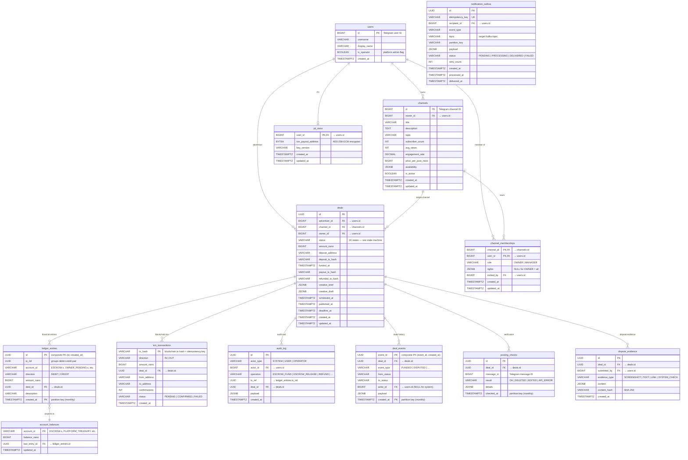

# Architecture: Data Stores (PostgreSQL)

## Overview

PostgreSQL 18 is the primary data store, housing 12+ tables organized by concern. Several tables use partitioning for efficient range queries and archival. The schema follows CQRS principles — `ledger_entries` (write model) and `account_balances` (read model) are separate.

## Entity-Relationship Diagram



## Table Categories

### Core Domain Tables

| Table | Type | Tags | Description |
|-------|------|------|-------------|
| `deals` | Component | — | Deal aggregate: status, escrow fields, creative data |
| `channel_memberships` | Component | — | Team RBAC: (channel_id, user_id), role, JSONB rights |

### Financial Tables

| Table | Type | Tags | Description |
|-------|------|------|-------------|
| `ledger_entries` | Event Store | `#financial`, `#immutable`, `#cqrs-write` | Double-entry journal, append-only, partitioned |
| `account_balances` | Component | `#financial`, `#cqrs-read` | Materialized CQRS projection from ledger events |
| `ton_transactions` | Component | `#financial`, `#idempotent` | PK by tx_hash, direction IN/OUT, amount_nano |
| `audit_log` | Event Store | `#financial`, `#immutable`, `#audit` | WORM financial audit trail |

### Event Tables

| Table | Type | Tags | Description |
|-------|------|------|-------------|
| `deal_events` | Event Store | `#immutable`, `#audit` | Partitioned immutable event stream for deal state |
| `posting_checks` | Component | — | Partitioned verification results |
| `dispute_evidence` | Event Store | `#immutable` | Append-only evidence records |

### Infrastructure Tables

| Table | Type | Tags | Description |
|-------|------|------|-------------|
| `notification_outbox` | Queue | `#outbox` | Transactional outbox for notifications |
| `pii_store` | Component | `#pii` | PII partition, AES-256-GCM encrypted |

## Key Table Schemas

### deals

```sql
CREATE TABLE deals (
    id              UUID PRIMARY KEY,
    advertiser_id   BIGINT NOT NULL,
    channel_id      BIGINT NOT NULL,
    owner_id        BIGINT NOT NULL,
    status          VARCHAR(50) NOT NULL,
    amount_nano     BIGINT NOT NULL,
    deposit_address VARCHAR(100),
    deposit_tx_hash VARCHAR(100),
    funded_at       TIMESTAMPTZ,
    payout_tx_hash  VARCHAR(100),
    refunded_tx_hash VARCHAR(100),
    creative_brief  JSONB,
    creative_draft  JSONB,
    scheduled_at    TIMESTAMPTZ,
    published_at    TIMESTAMPTZ,
    deadline_at     TIMESTAMPTZ,
    created_at      TIMESTAMPTZ NOT NULL DEFAULT NOW(),
    updated_at      TIMESTAMPTZ NOT NULL DEFAULT NOW()
);
```

### ledger_entries (partitioned)

```sql
CREATE TABLE ledger_entries (
    id              UUID NOT NULL,
    tx_ref          UUID NOT NULL,        -- groups debit+credit pair
    account_id      VARCHAR(200) NOT NULL, -- e.g., ESCROW:{deal_id}
    direction       VARCHAR(6) NOT NULL,   -- DEBIT or CREDIT
    amount_nano     BIGINT NOT NULL,
    deal_id         UUID,
    description     VARCHAR(500),
    created_at      TIMESTAMPTZ NOT NULL DEFAULT NOW(),
    PRIMARY KEY (id, created_at)
) PARTITION BY RANGE (created_at);
```

**Immutability invariant**: No UPDATE or DELETE operations permitted. Enforced by application-level checks and database triggers.

### account_balances (CQRS read model)

```sql
CREATE TABLE account_balances (
    account_id      VARCHAR(200) PRIMARY KEY,
    balance_nano    BIGINT NOT NULL DEFAULT 0,
    last_entry_id   UUID,
    updated_at      TIMESTAMPTZ NOT NULL DEFAULT NOW()
);
```

### ton_transactions

```sql
CREATE TABLE ton_transactions (
    tx_hash         VARCHAR(100) PRIMARY KEY, -- idempotency key
    direction       VARCHAR(3) NOT NULL,       -- IN or OUT
    amount_nano     BIGINT NOT NULL,
    deal_id         UUID REFERENCES deals(id),
    from_address    VARCHAR(100),
    to_address      VARCHAR(100),
    confirmations   INTEGER DEFAULT 0,
    status          VARCHAR(20) NOT NULL,
    created_at      TIMESTAMPTZ NOT NULL DEFAULT NOW()
);
```

### deal_events (partitioned)

```sql
CREATE TABLE deal_events (
    event_id    UUID NOT NULL,
    deal_id     UUID NOT NULL,
    event_type  VARCHAR(50) NOT NULL,
    from_status VARCHAR(50),
    to_status   VARCHAR(50),
    actor_id    BIGINT,
    payload     JSONB,
    created_at  TIMESTAMPTZ NOT NULL DEFAULT NOW(),
    PRIMARY KEY (event_id, created_at)
) PARTITION BY RANGE (created_at);
```

### channel_memberships

```sql
CREATE TABLE channel_memberships (
    channel_id  BIGINT NOT NULL,
    user_id     BIGINT NOT NULL,
    role        VARCHAR(20) NOT NULL,  -- OWNER or MANAGER
    rights      JSONB,                 -- NULL for OWNER (all rights)
    invited_by  BIGINT,
    created_at  TIMESTAMPTZ NOT NULL DEFAULT NOW(),
    updated_at  TIMESTAMPTZ NOT NULL DEFAULT NOW(),
    PRIMARY KEY (channel_id, user_id)
);
```

### users

```sql
CREATE TABLE users (
    id              BIGINT PRIMARY KEY,     -- Telegram user ID
    username        VARCHAR(100),
    display_name    VARCHAR(200),
    is_operator     BOOLEAN NOT NULL DEFAULT FALSE,
    created_at      TIMESTAMPTZ NOT NULL DEFAULT NOW()
);
-- No fixed "role" column. Actor role is contextual (ABAC):
--   Advertiser    = user referenced as deals.advertiser_id
--   Channel Owner = user with channel_memberships.role = 'OWNER'
--   Channel Admin = user with channel_memberships.role = 'MANAGER'
--   Operator      = user with is_operator = TRUE
```

### channels

```sql
CREATE TABLE channels (
    id                  BIGINT PRIMARY KEY, -- Telegram channel ID
    owner_id            BIGINT NOT NULL REFERENCES users(id),
    title               VARCHAR(200) NOT NULL,
    description         TEXT,
    topic               VARCHAR(50),
    subscriber_count    INTEGER DEFAULT 0,
    avg_views           INTEGER DEFAULT 0,
    engagement_rate     DECIMAL(5,2),
    price_per_post_nano BIGINT NOT NULL,
    availability        JSONB,
    is_active           BOOLEAN NOT NULL DEFAULT TRUE,
    created_at          TIMESTAMPTZ NOT NULL DEFAULT NOW(),
    updated_at          TIMESTAMPTZ NOT NULL DEFAULT NOW()
);
```

### audit_log (immutable)

```sql
CREATE TABLE audit_log (
    id          UUID PRIMARY KEY,
    actor_type  VARCHAR(20) NOT NULL,       -- SYSTEM, USER, OPERATOR
    actor_id    BIGINT,
    operation   VARCHAR(50) NOT NULL,       -- ESCROW_FUND, ESCROW_RELEASE, REFUND, ...
    tx_ref      UUID,                       -- reference to ledger_entries.tx_ref
    deal_id     UUID REFERENCES deals(id),
    payload     JSONB NOT NULL,
    created_at  TIMESTAMPTZ NOT NULL DEFAULT NOW()
);
```

### dispute_evidence (immutable)

```sql
CREATE TABLE dispute_evidence (
    id              UUID PRIMARY KEY,
    deal_id         UUID NOT NULL REFERENCES deals(id),
    submitted_by    BIGINT NOT NULL REFERENCES users(id),
    evidence_type   VARCHAR(20) NOT NULL,   -- SCREENSHOT, TEXT, LINK, SYSTEM_CHECK
    content         JSONB NOT NULL,
    content_hash    VARCHAR(64) NOT NULL,   -- SHA-256
    created_at      TIMESTAMPTZ NOT NULL DEFAULT NOW()
);
```

### posting_checks (partitioned)

```sql
CREATE TABLE posting_checks (
    id          UUID NOT NULL,
    deal_id     UUID NOT NULL,
    message_id  BIGINT NOT NULL,            -- Telegram message ID
    result      VARCHAR(20) NOT NULL,       -- OK, DELETED, EDITED, API_ERROR
    details     JSONB,
    checked_at  TIMESTAMPTZ NOT NULL DEFAULT NOW(),
    PRIMARY KEY (id, checked_at)
) PARTITION BY RANGE (checked_at);
```

### notification_outbox

```sql
CREATE TABLE notification_outbox (
    id              UUID PRIMARY KEY,
    idempotency_key VARCHAR(200) UNIQUE NOT NULL,
    recipient_id    BIGINT NOT NULL,
    event_type      VARCHAR(50) NOT NULL,
    topic           VARCHAR(100) NOT NULL,  -- target Kafka topic
    partition_key   VARCHAR(200),
    payload         JSONB NOT NULL,
    status          VARCHAR(20) NOT NULL DEFAULT 'PENDING',
    retry_count     INTEGER NOT NULL DEFAULT 0,
    created_at      TIMESTAMPTZ NOT NULL DEFAULT NOW(),
    processed_at    TIMESTAMPTZ,
    delivered_at    TIMESTAMPTZ
);
CREATE INDEX idx_outbox_pending ON notification_outbox(status, created_at)
    WHERE status = 'PENDING';
```

### pii_store (encrypted)

```sql
CREATE TABLE pii_store (
    user_id             BIGINT PRIMARY KEY REFERENCES users(id),
    ton_payout_address  BYTEA NOT NULL,     -- AES-256-GCM encrypted
    key_version         VARCHAR(10) NOT NULL DEFAULT 'v1',
    created_at          TIMESTAMPTZ NOT NULL DEFAULT NOW(),
    updated_at          TIMESTAMPTZ NOT NULL DEFAULT NOW()
);
```

## Partitioning Strategy

| Table | Partition Key | Strategy | Rationale |
|-------|--------------|----------|-----------|
| `ledger_entries` | `created_at` | RANGE (monthly) | Efficient range queries, cold data archival |
| `deal_events` | `created_at` | RANGE (monthly) | Event stream queries, archival |
| `posting_checks` | `checked_at` | RANGE (monthly) | Verification data archival |

## Immutable Tables

Tables marked with `#immutable` tag enforce append-only semantics:

- `ledger_entries` — financial source of truth
- `deal_events` — audit trail for deal state changes
- `audit_log` — WORM financial audit trail
- `dispute_evidence` — evidence integrity

No UPDATE or DELETE is permitted on these tables.

## Related Documents

- [Backend API Components](./03-backend-api-components.md) — services that access these tables
- [Ledger Design](../07-financial-system/01-ledger-design.md) — detailed ledger structure
- [CQRS Pattern](../05-patterns-and-decisions/02-cqrs.md)
- [Event Sourcing](../05-patterns-and-decisions/01-event-sourcing.md)
- [Deployment](../09-deployment.md) — sharding strategy for Scaled deployment
