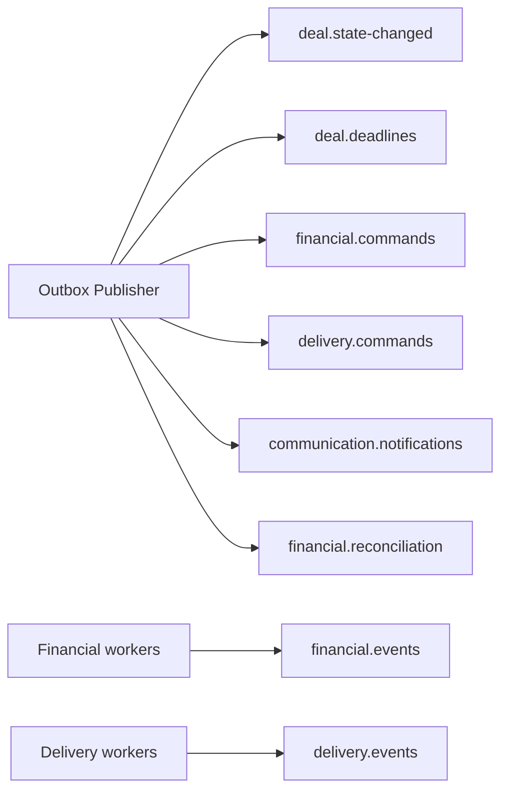

# Architecture: Kafka Topology

## Overview

Apache Kafka is the event backbone. Current topic names are defined in code in
`advert-market-shared/src/main/java/com/advertmarket/shared/event/TopicNames.java`.

This document mirrors the current constants and consumer group names.

## Topic Map

## Topics (Implemented Names)

| Topic constant | Topic name | Purpose |
|---|---|---|
| `DEAL_STATE_CHANGED` | `deal.state-changed` | Deal state transitions and domain events |
| `DEAL_DEADLINES` | `deal.deadlines` | Deadline-related events |
| `FINANCIAL_COMMANDS` | `financial.commands` | Financial command bus |
| `FINANCIAL_EVENTS` | `financial.events` | Financial result events |
| `DELIVERY_COMMANDS` | `delivery.commands` | Delivery command bus |
| `DELIVERY_EVENTS` | `delivery.events` | Delivery result events |
| `COMMUNICATION_NOTIFICATIONS` | `communication.notifications` | Notification events for communication module |
| `FINANCIAL_RECONCILIATION` | `financial.reconciliation` | Reconciliation triggers/events |

## Consumer Groups (Current Constants)

| Consumer group constant | Group ID |
|---|---|
| `FINANCIAL_COMMAND_HANDLER` | `financial-command-handler` |
| `DELIVERY_COMMAND_HANDLER` | `delivery-command-handler` |
| `NOTIFICATION_SENDER` | `notification-sender` |
| `DEAL_STATE_PROJECTION` | `deal-state-projection` |
| `DEAL_DEADLINE_SCHEDULER` | `deal-deadline-scheduler` |
| `TON_DEPOSIT_WATCHER` | `ton-deposit-watcher` |
| `TON_PAYOUT_EXECUTOR` | `ton-payout-executor` |
| `RECONCILIATION_HANDLER` | `reconciliation-handler` |
| `ANALYTICS_COLLECTOR` | `analytics-collector` |
| `DEAD_LETTER_PROCESSOR` | `dead-letter-processor` |
| `FINANCIAL_EVENT_HANDLER` | `financial-event-handler` |
| `DELIVERY_EVENT_HANDLER` | `delivery-event-handler` |
| `RECONCILIATION_RESULT_HANDLER` | `reconciliation-result-handler` |

## Notes on Legacy Names

Legacy documentation names such as `deal.events`, `notifications.outbox`, and
`escrow.commands` are deprecated for `HEAD` and replaced by the topic constants above.

## Related Documents

- [Workers](./04-workers.md)
- [Transactional Outbox](../05-patterns-and-decisions/03-transactional-outbox.md)
- [Kafka Event Schemas](../14-implementation-specs/04-kafka-event-schemas.md)
