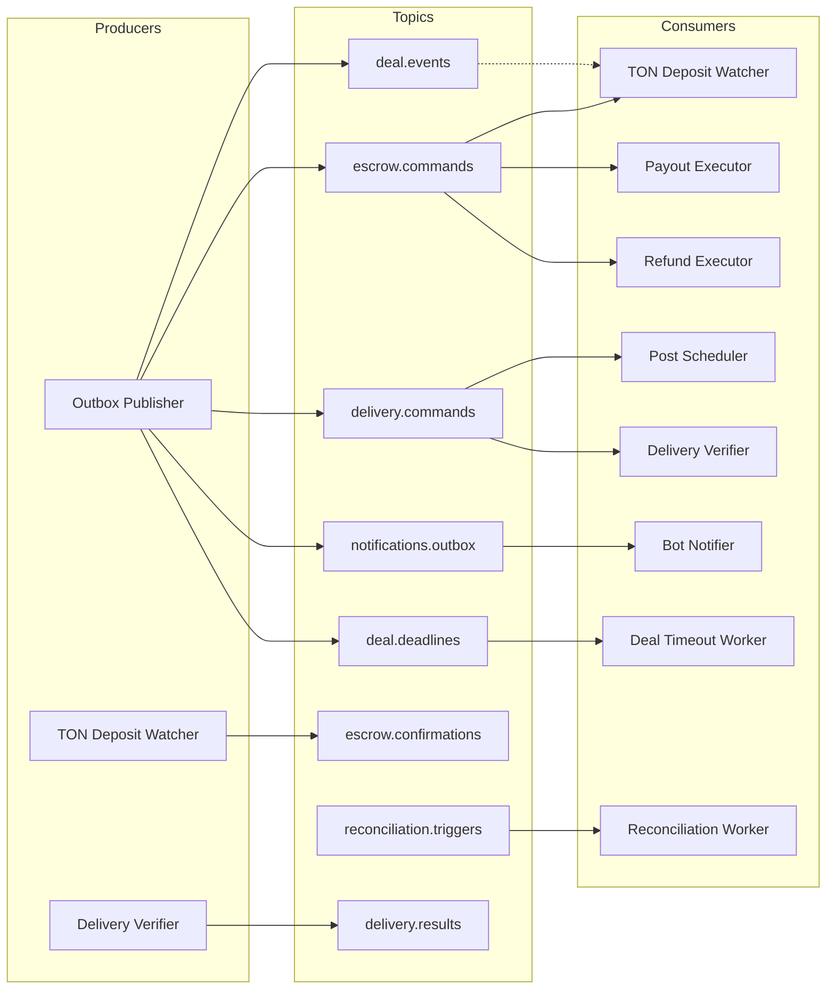

# Architecture: Kafka Topology

## Overview

Apache Kafka serves as the event streaming backbone with 8 topics. All topics are partitioned by `deal_id` to maintain per-deal ordering guarantees. The Outbox Publisher is the primary producer, and workers + bot are the consumers.

## Topic Map

## Topics

### 1. deal.events

| Attribute | Value |
|-----------|-------|
| **Description** | Domain events from deal state machine — fan-out for all workers |
| **Partition key** | `deal_id` |
| **Producer** | Outbox Publisher |
| **Consumers** | Various (fan-out) |
| **Schema** | Deal event envelope: `{deal_id, event_type, from_status, to_status, payload, timestamp}` |

### 2. escrow.commands

| Attribute | Value |
|-----------|-------|
| **Tags** | `#financial` |
| **Description** | Commands for deposit watcher, payout/refund executors |
| **Partition key** | `deal_id` |
| **Producer** | Outbox Publisher |
| **Consumers** | TON Deposit Watcher, Payout Executor, Refund Executor |
| **Command types** | `WATCH_DEPOSIT`, `EXECUTE_PAYOUT`, `EXECUTE_REFUND` |

### 3. escrow.confirmations

| Attribute | Value |
|-----------|-------|
| **Tags** | `#financial` |
| **Description** | Results from TON deposit watcher: funding confirmed/failed |
| **Partition key** | `deal_id` |
| **Producer** | TON Deposit Watcher |
| **Consumers** | Backend API (via worker callback) |

### 4. delivery.commands

| Attribute | Value |
|-----------|-------|
| **Description** | Commands for post scheduler and delivery verifier |
| **Partition key** | `deal_id` |
| **Producer** | Outbox Publisher |
| **Consumers** | Post Scheduler, Delivery Verifier |
| **Command types** | `PUBLISH_POST`, `VERIFY_DELIVERY` |

### 5. delivery.results

| Attribute | Value |
|-----------|-------|
| **Description** | Verification results from delivery verifier |
| **Partition key** | `deal_id` |
| **Producer** | Delivery Verifier |
| **Consumers** | Backend API (via worker callback) |
| **Result types** | `DELIVERY_VERIFIED`, `DELIVERY_FAILED` |

### 6. notifications.outbox

| Attribute | Value |
|-----------|-------|
| **Description** | Notification events for bot notifier |
| **Partition key** | `recipient_id` |
| **Producer** | Outbox Publisher |
| **Consumer** | Bot Notifier |

### 7. reconciliation.triggers

| Attribute | Value |
|-----------|-------|
| **Tags** | `#financial`, `#audit` |
| **Description** | Periodic reconciliation trigger events |
| **Producer** | Scheduled (cron-based or external trigger) |
| **Consumer** | Reconciliation Worker |

### 8. deal.deadlines

| Attribute | Value |
|-----------|-------|
| **Description** | Deadline events for timeout worker |
| **Partition key** | `deal_id` |
| **Producer** | Outbox Publisher |
| **Consumer** | Deal Timeout Worker |

## Consumer Groups

| Consumer Group | Worker | Topics |
|---------------|--------|--------|
| `cg-deposit-watcher` | TON Deposit Watcher | `escrow.commands` |
| `cg-payout-executor` | Payout Executor | `escrow.commands` |
| `cg-refund-executor` | Refund Executor | `escrow.commands` |
| `cg-deal-timeout` | Deal Timeout Worker | `deal.deadlines` |
| `cg-post-scheduler` | Post Scheduler | `delivery.commands` |
| `cg-delivery-verifier` | Delivery Verifier | `delivery.commands` |
| `cg-reconciliation` | Reconciliation Worker | `reconciliation.triggers` |
| `cg-bot-notifier` | Bot Notifier | `notifications.outbox` |

## Ordering Guarantees

- All financial topics partitioned by `deal_id` → per-deal ordering
- `notifications.outbox` partitioned by `recipient_id` → per-user ordering
- Consumer groups ensure each partition is processed by exactly one instance

## Related Documents

- [Workers](./04-workers.md) — worker details
- [Transactional Outbox](../05-patterns-and-decisions/03-transactional-outbox.md) — how events reach Kafka
- [Notifications](../03-feature-specs/08-notifications.md) — notification pipeline
