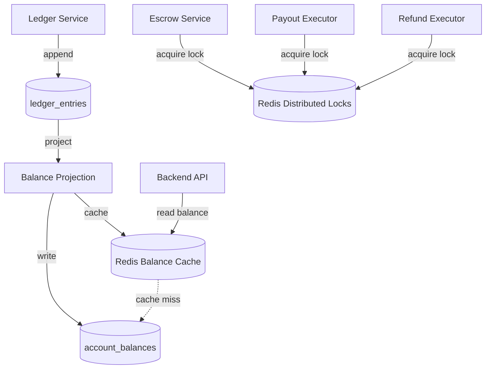

# Architecture: Redis Usage

## Overview

Redis 8 serves two distinct purposes in the platform: **balance caching** (CQRS read model performance) and **distributed locking** (escrow/payout deduplication).

## Components

### Balance Cache

| Attribute | Value |
|-----------|-------|
| **Tags** | `#cqrs-read` |
| **Purpose** | TTL-based cache for `account_balances` |
| **Target** | p99 < 200ms for balance queries |
| **Written by** | Balance Projection service |
| **Read by** | Escrow UI (via Backend API) |

#### Key Schema

```
balance:{account_id} → {balance_nano: int64, last_entry_id: uuid, updated_at: timestamp}
```

Examples:
```
balance:ESCROW:550e8400-e29b-41d4-a716-446655440000 → {"balance_nano": 1000000000, ...}
balance:OWNER_PENDING:123456789 → {"balance_nano": 900000000, ...}
balance:PLATFORM_TREASURY → {"balance_nano": 100000000, ...}
```

#### Cache Strategy

- **Write-through**: Balance Projection writes to both PostgreSQL `account_balances` and Redis
- **TTL**: Configurable per account type (default 5 minutes)
- **Cache miss**: Falls back to PostgreSQL `account_balances` table
- **Invalidation**: On new ledger entry, cache is updated synchronously

### Distributed Locks

| Attribute | Value |
|-----------|-------|
| **Tags** | `#idempotent` |
| **Purpose** | Prevent double execution of financial operations |
| **Used by** | Escrow Service, Payout/Refund Executors, Reconciliation Worker |

#### Lock Key Schema

```
lock:escrow:{deal_id}         → prevents concurrent escrow operations on same deal
lock:payout:{deal_id}         → prevents double payout execution
lock:refund:{deal_id}         → prevents double refund execution
lock:reconciliation           → prevents concurrent reconciliation runs
```

#### Lock Properties

- **Algorithm**: Redis `SET NX EX` (set if not exists, with expiry)
- **TTL**: 30 seconds (configurable per operation type)
- **Release**: Explicit unlock on completion, or auto-expire on failure
- **Fencing token**: Included for safe lock verification

## Data Flow



### Update Dedup Keys

| Attribute | Value |
|-----------|-------|
| **Tags** | `#idempotent` |
| **Purpose** | Telegram webhook deduplication |
| **Written by** | Webhook Handler (Update Deduplicator) |
| **Read by** | Webhook Handler |

#### Key Schema

```
tg:update:{update_id} → "1"
```

- **Algorithm**: `SET NX EX` (set if not exists, with expiry)
- **TTL**: 24 hours
- **Purpose**: Prevent processing same Telegram update twice

### Canary Config

| Attribute | Value |
|-----------|-------|
| **Purpose** | Feature-flag routing for A/B testing and canary releases |
| **Read by** | Canary Router (Telegram Bot) |
| **Written by** | Platform Operator (manual or CI/CD) |

#### Key Schema

```
canary:percent → 10          # % of users routed to canary
canary:salt    → "abc123"    # salt for deterministic routing
```

**Routing algorithm**: `SHA-256(user_id + salt) % 100 < percent` → canary, else stable. Local cache: 5s TTL.

### Worker Heartbeats

| Attribute | Value |
|-----------|-------|
| **Purpose** | Worker health monitoring |
| **Written by** | Each worker instance |
| **Read by** | Health check endpoint, monitoring |

#### Key Schema

```
worker:{type}:{instance_id} → {timestamp, status}
```

- **TTL**: 30 seconds (auto-expire if worker stops)
- **Missing heartbeat > 60s**: triggers CRITICAL alert

## Cache Invalidation Strategy

| Data Type | TTL | Invalidation |
|-----------|-----|-------------|
| Balance cache | 5 min (configurable per account type) | Write-through on ledger entry |
| Update dedup | 24h | Natural TTL expiry |
| Canary config | No TTL (persistent) | Manual update |
| Worker heartbeat | 30s | Auto-expire |
| Distributed locks | 30s (configurable) | Explicit release or auto-expire |

**Eviction policy**: `allkeys-lru` — balance cache entries are evicted first under memory pressure.

## MVP Configuration

| Setting | Value |
|---------|-------|
| **Deployment** | Managed Redis (single instance) |
| **Max memory** | 256 MB |
| **Eviction policy** | `allkeys-lru` |
| **Persistence** | RDB snapshots every 60s (1000+ keys changed) + AOF appendfsync everysec |

## Scaled Configuration

| Setting | Value |
|---------|-------|
| **Deployment** | Redis Cluster |
| **Nodes** | 3+ masters with replicas |
| **Locks** | Redlock algorithm across cluster nodes |

## Related Documents

- [CQRS Pattern](../05-patterns-and-decisions/02-cqrs.md)
- [Idempotency Strategy](../05-patterns-and-decisions/07-idempotency-strategy.md)
- [Data Stores](./05-data-stores.md) — PostgreSQL `account_balances` table
- [Deployment](../09-deployment.md) — Redis scaling strategy
