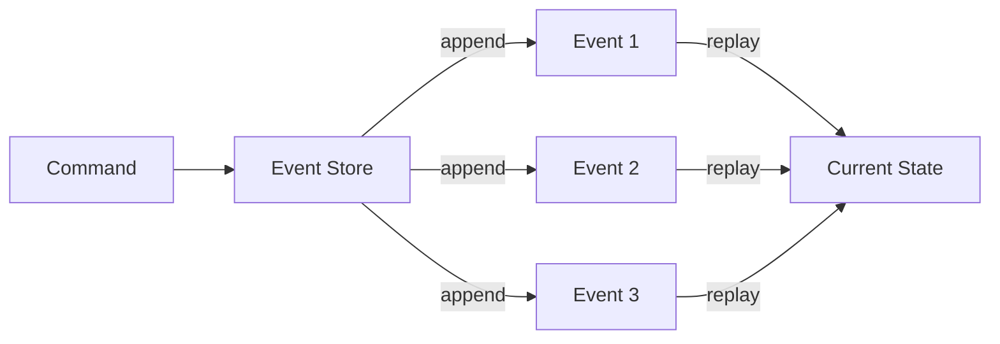

# Pattern: Event Sourcing

## Decision

Use Event Sourcing for financial operations and deal state tracking.

## Context

The platform handles money (TON escrow) and must provide a complete, immutable audit trail. Traditional CRUD operations lose history — we need to know not just the current state, but the full sequence of changes.

## How It Works

Instead of updating records in place, every state change is recorded as an **immutable event**. Current state is derived by replaying events.

## Event Stores in the System

### deal_events

- **Purpose**: Complete history of deal state transitions
- **Partition**: By `created_at` (monthly)
- **Immutability**: No UPDATE/DELETE permitted
- **Schema**: `{event_id, deal_id, event_type, from_status, to_status, actor_id, payload, created_at}`
- **Consumers**: Deal state reconstruction, audit queries, analytics

### ledger_entries

- **Purpose**: Financial source of truth — every money movement
- **Partition**: By `created_at` (monthly)
- **Immutability**: No UPDATE/DELETE permitted
- **Schema**: Double-entry pairs (debit + credit) with `tx_ref` grouping
- **Consumers**: Balance Projection (CQRS read model), Reconciliation Service, audit

### audit_log

- **Purpose**: WORM financial audit trail
- **Immutability**: Write Once Read Many
- **Schema**: `{actor, timestamp, operation, payload}`

### dispute_evidence

- **Purpose**: Append-only evidence records for disputes
- **Immutability**: No modification after submission
- **Schema**: `{deal_id, submitted_by, evidence_type, content, content_hash, created_at}`

## Benefits

| Benefit | Application |
|---------|-------------|
| **Complete audit trail** | Every financial operation and deal transition is recorded |
| **Temporal queries** | "What was the deal status at time T?" |
| **Compliance** | Immutable records satisfy financial audit requirements |
| **Debugging** | Replay events to understand how state was reached |
| **Dispute resolution** | Full evidence chain for resolving disputes |

## Trade-offs

| Trade-off | Mitigation |
|-----------|-----------|
| Storage growth | Partitioning by `created_at`, cold data archival |
| Query complexity | CQRS read models (`account_balances`) for fast queries |
| Eventual consistency | Acceptable for balance reads (cached in Redis) |

## Enforcement

Immutability is enforced at multiple levels:

1. **Application**: Services only call `INSERT`, never `UPDATE`/`DELETE` on event stores
2. **Database**: PostgreSQL triggers or rules to reject mutations
3. **CQRS**: Read models are separate tables, mutations happen there

## Related Documents

- [CQRS](./02-cqrs.md) — read model projections
- [Double-Entry Ledger](./05-double-entry-ledger.md) — financial event sourcing
- [Data Stores](../04-architecture/05-data-stores.md) — table schemas
- [Deal State Machine](../06-deal-state-machine.md) — event-emitting transitions
