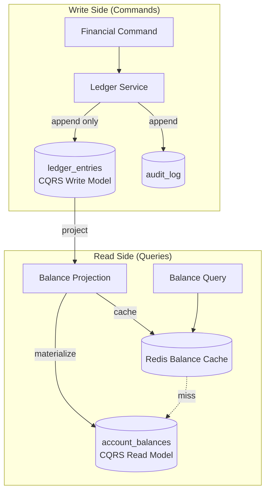

# Pattern: CQRS (Command Query Responsibility Segregation)

## Decision

Separate write and read models for financial data to optimize both write throughput and read latency.

## Context

Financial operations require strict consistency (double-entry ledger, append-only), but balance queries need to be fast (< 200ms p99). CQRS solves this by maintaining separate models for writes and reads.

## Architecture



## Write Model: ledger_entries

- **Tagged**: `#cqrs-write`
- **Properties**: Immutable, append-only, partitioned by `created_at`
- **Operations**: INSERT only (double-entry pairs)
- **Source of truth**: This is the authoritative record of all money movement

## Read Model: account_balances

- **Tagged**: `#cqrs-read`
- **Properties**: Materialized projection, mutable (updated on each new entry)
- **Operations**: Upsert balance on new ledger entry
- **Derived from**: Aggregating ledger_entries by account_id

## Cache Layer: Redis Balance Cache

- **Tagged**: `#cqrs-read`
- **Properties**: TTL-based, write-through
- **Target**: p99 < 200ms for balance queries
- **Fallback**: PostgreSQL `account_balances`

## Projection Flow

1. Ledger Service appends entries to `ledger_entries`
2. Balance Projection (triggered synchronously or via event) reads new entries
3. Balance Projection updates `account_balances` (SUM of credits - SUM of debits per account)
4. Balance Projection updates Redis Balance Cache (write-through)

```
New ledger entry → Balance Projection →
  → UPDATE account_balances SET balance_nano = (SELECT SUM(...) FROM ledger_entries WHERE account_id = ?)
  → SET balance:{account_id} in Redis
```

## Consistency Model

| Model | Consistency | Latency |
|-------|------------|---------|
| `ledger_entries` | Strong (write within transaction) | N/A (write only) |
| `account_balances` | Strong (updated within same transaction or immediately after) | Low |
| Redis cache | Eventual (write-through, TTL-based) | Very low (< 5ms) |

## Benefits

- **Write optimization**: Append-only writes to ledger are fast and conflict-free
- **Read optimization**: Pre-computed balances, cached in Redis
- **Auditability**: Write model is immutable, complete history preserved
- **Scalability**: Read and write models can be scaled independently

## Related Documents

- [Event Sourcing](./01-event-sourcing.md) — immutable event stores
- [Double-Entry Ledger](./05-double-entry-ledger.md) — write model structure
- [Redis Usage](../04-architecture/07-redis-usage.md) — cache layer details
- [Data Stores](../04-architecture/05-data-stores.md) — table schemas
- [Ledger Design](../07-financial-system/01-ledger-design.md)
