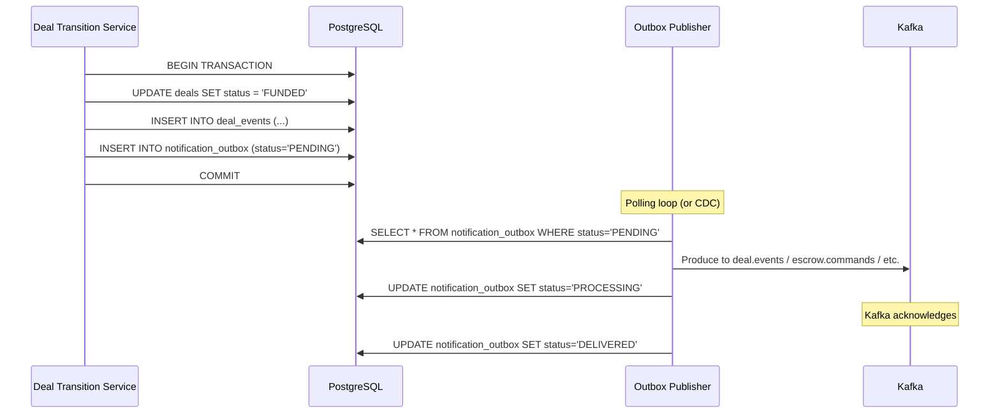

# Pattern: Transactional Outbox

## Decision

Use the Transactional Outbox pattern to reliably publish domain events to Kafka without dual-write problems.

## Context

When a deal transitions state, we need to both update the database and publish an event to Kafka. Without an outbox, we face the dual-write problem:

- **DB first, then Kafka**: If Kafka publish fails, event is lost
- **Kafka first, then DB**: If DB write fails, event was published for uncommitted data

## How It Works



## Implementation Options

### Option A: Polling Publisher (MVP)

The Outbox Publisher service periodically polls `notification_outbox` for `PENDING` records:

```sql
SELECT * FROM notification_outbox
WHERE status = 'PENDING'
ORDER BY created_at
LIMIT 100
FOR UPDATE SKIP LOCKED;
```

- **Pros**: Simple, no additional infrastructure
- **Cons**: Polling delay (configurable, default 1s), slight latency

### Option B: Debezium CDC (Scaled)

Debezium captures changes to `notification_outbox` via PostgreSQL WAL and publishes to Kafka:

- **Pros**: Near-zero latency, no polling
- **Cons**: Additional infrastructure (Debezium connector)

## notification_outbox Table

| Column | Type | Description |
|--------|------|-------------|
| `id` | `BIGSERIAL` | Outbox record ID |
| `deal_id` | `UUID` | Related deal (nullable) |
| `idempotency_key` | `VARCHAR(200)` | Deduplication key (unique) |
| `topic` | `VARCHAR(100)` | Target Kafka topic |
| `partition_key` | `VARCHAR(100)` | Kafka partition key (usually `deal_id`) |
| `payload` | `JSONB` | Event payload |
| `status` | `VARCHAR(20)` | `PENDING` → `PROCESSING` → `DELIVERED` / `FAILED` |
| `retry_count` | `INTEGER` | Delivery attempts |
| `version` | `INTEGER` | Optimistic locking |
| `created_at` | `TIMESTAMPTZ` | Created within domain transaction |
| `processed_at` | `TIMESTAMPTZ` | When picked up by publisher |

## Kafka Topics Produced

The Outbox Publisher routes messages to 5 Kafka topics based on event type:

| Topic | Event Types |
|-------|------------|
| `deal.events` | All deal state transitions |
| `escrow.commands` | `WATCH_DEPOSIT`, `EXECUTE_PAYOUT`, `EXECUTE_REFUND` |
| `delivery.commands` | `PUBLISH_POST`, `VERIFY_DELIVERY` |
| `notifications.outbox` | All notification events |
| `deal.deadlines` | Deadline scheduling events |

## Guarantees

- **At-least-once delivery**: Outbox records are retried until acknowledged
- **Idempotency**: Consumers must handle duplicate messages (via `idempotency_key`)
- **Ordering**: Per-partition ordering in Kafka (partitioned by `deal_id`)
- **No data loss**: Events are part of the same DB transaction as the domain operation

## Related Documents

- [Kafka Topology](../04-architecture/06-kafka-topology.md) — topics and consumers
- [Idempotency Strategy](./07-idempotency-strategy.md) — consumer-side deduplication
- [Backend API Components](../04-architecture/03-backend-api-components.md) — Outbox Publisher service
- [Notifications](../03-feature-specs/08-notifications.md) — notification pipeline
