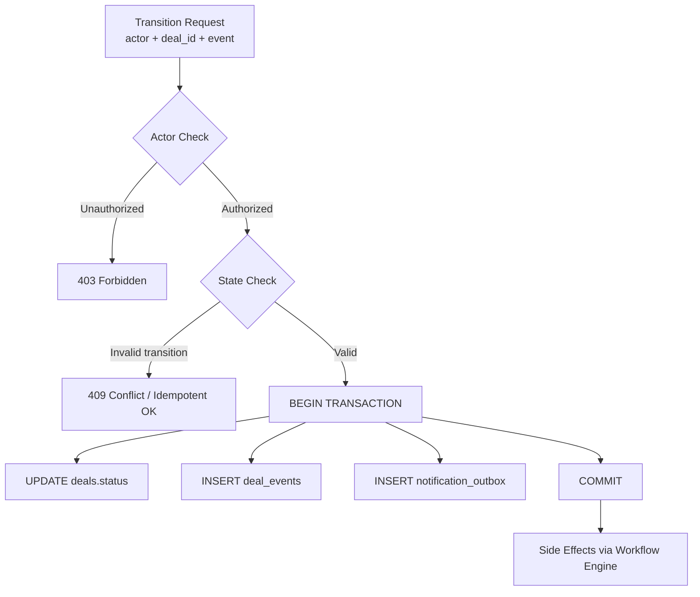

# Pattern: State Machine

## Decision

Implement deal lifecycle as a formal state machine with actor-checked, idempotent, event-emitting transitions.

## Context

The deal lifecycle has 17 states and many transition paths involving multiple actors, timeouts, and financial side-effects. A formal state machine ensures:

- Only valid transitions are allowed
- Only authorized actors can trigger transitions
- Every transition produces exactly one event
- Side-effects are orchestrated predictably

## Implementation Structure

## Key Properties

### Actor-Checked

Each transition has an allowed set of actors:

| Transition | Allowed Actors |
|-----------|---------------|
| Submit offer | Advertiser |
| Accept offer | Channel Owner |
| Submit creative | Channel Owner, Channel Admin (with `moderate` right) |
| Approve creative | Advertiser |
| Publish | Channel Owner, Channel Admin (with `publish` right) |
| Deposit confirmed | System (TON Deposit Watcher) |
| Delivery verified | System (Delivery Verifier) |
| Resolve dispute | Platform Operator |
| Timeout expiry | System (Deal Timeout Worker) |

### Idempotent

Duplicate transition attempts for the same `(deal_id, from_status, to_status)` are safely handled:

- If the deal is already in the target state → return success (no-op)
- If the deal is in a different state → return 409 Conflict
- Prevents race conditions between concurrent workers

### Event-Emitting

Every successful transition:

1. Appends to `deal_events` table (immutable event store)
2. Writes to `notification_outbox` (for Kafka publishing)
3. The Outbox Publisher delivers to `deal.events` Kafka topic

## Side-Effect Orchestration

The **Deal Workflow Engine** handles side-effects based on the transition:

| Transition | Side Effects |
|-----------|-------------|
| → `ACCEPTED` | Generate deposit address |
| → `FUNDED` | Record ledger entries (escrow hold) |
| → `CREATIVE_APPROVED` | Enable publication |
| → `PUBLISHED` | Start delivery verification |
| → `COMPLETED_RELEASED` | Release escrow, deduct commission, execute payout |
| → `DISPUTED` | Freeze escrow |
| → `CANCELLED` (if funded) | Execute refund |
| → `REFUNDED` | Execute refund |
| → `EXPIRED` (if funded) | Execute refund |

## Transaction Boundary

All within a single database transaction:
1. Deal status update
2. Deal event append
3. Outbox message insert
4. Financial ledger entries (if applicable)

Side-effects that involve external systems (TON payout, Telegram posting) are handled asynchronously via Kafka workers.

## Related Documents

- [Deal State Machine](../06-deal-state-machine.md) — complete state diagram and transitions
- [Event Sourcing](./01-event-sourcing.md) — event storage
- [Transactional Outbox](./03-transactional-outbox.md) — event publishing
- [Workers](../04-architecture/04-workers.md) — async side-effect executors
