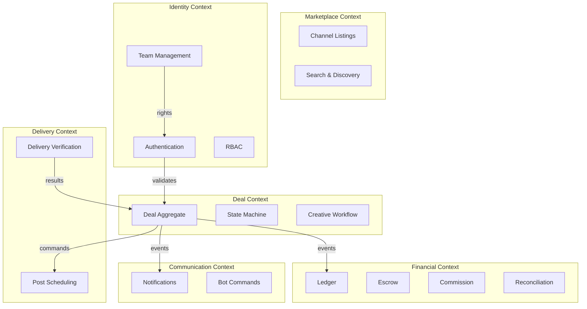

# Pattern: DDD Bounded Contexts

## Decision

Organize the system into bounded contexts aligned with business capabilities, using aggregates as consistency boundaries.

## Bounded Contexts

## Context Details

### 1. Marketplace Context

| Aspect | Details |
|--------|---------|
| **Aggregates** | Channel Listing |
| **Services** | Channel search, statistics refresh |
| **Data** | Channel listings, subscriber counts, pricing |
| **Boundary** | Self-contained, read-heavy |

### 2. Deal Context

| Aspect | Details |
|--------|---------|
| **Aggregate** | Deal (central aggregate) |
| **Services** | Deal Transition Service, Deal Workflow Engine, Dispute Service |
| **Data** | `deals`, `deal_events`, `dispute_evidence` |
| **Boundary** | Owns deal lifecycle, delegates financial operations |

### 3. Financial Context

| Aspect | Details |
|--------|---------|
| **Aggregates** | Ledger Entry, Account Balance |
| **Services** | Ledger Service, Escrow Service, Commission Service, Reconciliation Service, TON Payment Gateway, Confirmation Policy, Balance Projection |
| **Data** | `ledger_entries`, `account_balances`, `ton_transactions`, `audit_log` |
| **Boundary** | Strict isolation — only accepts commands from Deal Context |

### 4. Identity Context

| Aspect | Details |
|--------|---------|
| **Aggregates** | User Session, Channel Membership |
| **Services** | Auth Service, Channel Team Service |
| **Data** | `channel_memberships`, sessions |
| **Boundary** | Cross-cutting — validates all requests |

### 5. Delivery Context

| Aspect | Details |
|--------|---------|
| **Aggregates** | Posting Check |
| **Services** | Post Scheduler (worker), Delivery Verifier (worker) |
| **Data** | `posting_checks` |
| **Boundary** | Async — consumes commands, produces results |

### 6. Communication Context

| Aspect | Details |
|--------|---------|
| **Aggregates** | Notification |
| **Services** | Bot Notifier, Bot Command Router, Outbox Publisher |
| **Data** | `notification_outbox` |
| **Boundary** | Async — consumes events, delivers messages |

## Inter-Context Communication

| From | To | Mechanism | Example |
|------|----|-----------|---------|
| Deal → Financial | Sync (same process) | Deal Workflow Engine calls Escrow Service |
| Deal → Delivery | Async (Kafka) | `delivery.commands` topic |
| Deal → Communication | Async (Kafka) | `notifications.outbox` topic |
| Delivery → Deal | Async (callback) | Worker Callback Controller |
| Identity → Deal | Sync (same process) | Auth Service validates requests |

## Aggregate Rules

1. **One transaction per aggregate**: Each DB transaction modifies one aggregate root
2. **Reference by ID**: Aggregates reference each other by ID, not direct object reference
3. **Eventual consistency**: Cross-aggregate consistency via events (Kafka)
4. **Exception**: Financial operations (ledger + deal status) share a transaction for atomicity

## Related Documents

- [Backend API Components](../04-architecture/03-backend-api-components.md) — service organization
- [State Machine](./04-state-machine.md) — Deal aggregate transitions
- [Event Sourcing](./01-event-sourcing.md) — event stores per context
- [Transactional Outbox](./03-transactional-outbox.md) — cross-context communication
