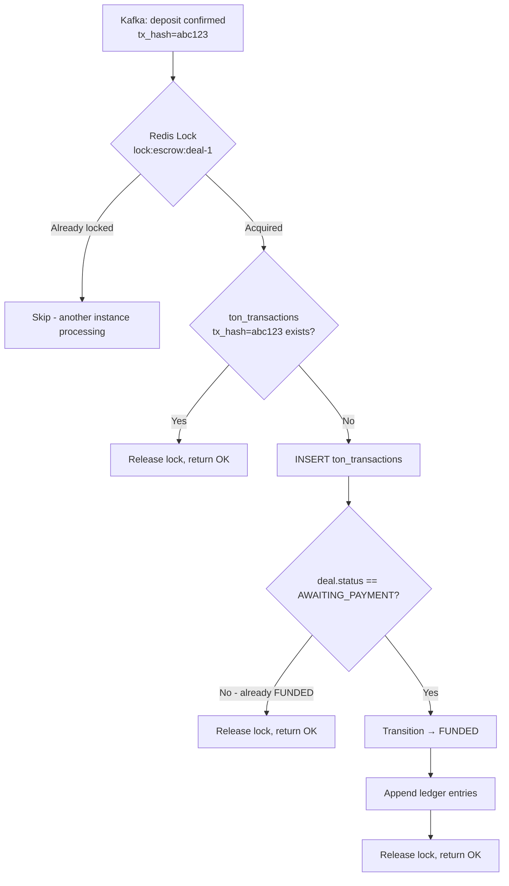

# Pattern: Idempotency Strategy

## Decision

All financial operations and worker callbacks must be idempotent to handle retries, duplicate messages, and network failures safely.

## Context

In a distributed system with Kafka, workers, and blockchain interactions, messages can be delivered more than once. Financial operations (deposit confirmation, payout, refund) must never be executed twice.

## Idempotency Layers

### Layer 1: Database Primary Keys

| Table | Idempotency Key | Mechanism |
|-------|----------------|-----------|
| `ton_transactions` | `tx_hash` (PK) | Duplicate blockchain transactions rejected by PK constraint |
| `ledger_entries` | `id` (PK within partition) | Duplicate entries rejected by PK constraint |
| `deal_events` | `event_id` (PK within partition) | Duplicate events rejected by PK constraint |
| `notification_outbox` | `idempotency_key` (UNIQUE) | Duplicate notifications rejected by unique constraint |

### Layer 2: State Machine Guards

The Deal Transition Service checks current state before applying a transition:

```
IF deal.status == target_status THEN return OK (idempotent no-op)
IF deal.status != expected_from_status THEN return 409 Conflict
```

This ensures that duplicate callbacks (e.g., two "deposit confirmed" messages) are handled safely.

### Layer 3: Redis Distributed Locks

Critical financial operations acquire Redis locks before execution:

| Operation | Lock Key | TTL |
|-----------|----------|-----|
| Escrow deposit processing | `lock:escrow:{deal_id}` | 30s |
| Payout execution | `lock:payout:{deal_id}` | 30s |
| Refund execution | `lock:refund:{deal_id}` | 30s |
| Reconciliation run | `lock:reconciliation` | 300s |

Lock acquisition pattern:
```
SET lock:payout:{deal_id} {unique_token} NX EX 30
```

If lock already held → skip (another instance is processing).

### Layer 4: Kafka Consumer Offsets

Workers use **manual offset commit** after successful processing:

1. Consume message
2. Process (acquire lock, execute, callback)
3. Commit offset

If processing fails, the message is not committed and will be redelivered — but Layers 1-3 prevent double execution.

## Idempotency Flow Example: Deposit Confirmation



## Tagged Components

Components with `#idempotent` tag:

- **Deal Transition Service** — state machine guards
- **Escrow Service** — Redis locks + PK constraints
- **Payout Executor** — Redis locks + `tx_hash` PK
- **Refund Executor** — Redis locks + `tx_hash` PK
- **ton_transactions** — `tx_hash` as PK

## Related Documents

- [Redis Usage](../04-architecture/07-redis-usage.md) — distributed locks
- [State Machine](./04-state-machine.md) — idempotent transitions
- [Double-Entry Ledger](./05-double-entry-ledger.md) — PK-based dedup
- [Workers](../04-architecture/04-workers.md) — worker callback pattern
