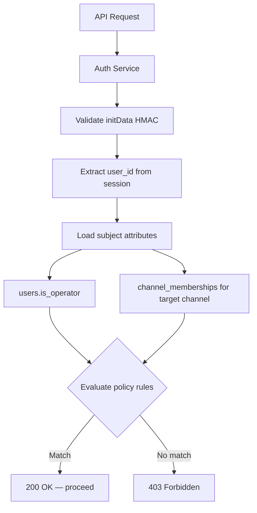

# Pattern: ABAC (Attribute-Based Access Control)

## Decision

Use Attribute-Based Access Control instead of traditional RBAC with fixed user roles. Actor role is determined at runtime from the relationship between the user and the resource.

## Context

A single Telegram user can simultaneously be:
- An **Advertiser** buying ads on channel A
- A **Channel Owner** selling ads on channel B
- A **Channel Admin** managing deals for channel C

A fixed `role` column on `users` cannot express this. ABAC resolves permissions dynamically based on attributes of the subject, resource, action, and context.

## Attribute Categories

### Subject Attributes (who)

| Attribute | Source | Example |
|-----------|--------|---------|
| `user.id` | Session (from Telegram initData) | `42` |
| `user.is_operator` | `users.is_operator` | `true` / `false` |
| `user.memberships` | `channel_memberships` query | `[{channel: X, role: OWNER}, {channel: Y, role: MANAGER, rights: {...}}]` |

### Resource Attributes (what)

| Attribute | Source | Example |
|-----------|--------|---------|
| `deal.advertiser_id` | `deals` table | `42` |
| `deal.owner_id` | `deals` table | `99` |
| `deal.channel_id` | `deals` table | `X` |
| `deal.status` | `deals` table | `CREATIVE_SUBMITTED` |
| `deal.amount_nano` | `deals` table | `1000000000000` |
| `channel.owner_id` | `channels` table | `99` |

### Action Attributes (operation)

| Action | Description |
|--------|-------------|
| `deal:create` | Create a new deal offer |
| `deal:accept` | Accept a deal offer |
| `deal:cancel` | Cancel a deal |
| `creative:submit` | Submit creative draft |
| `creative:approve` | Approve creative |
| `creative:publish` | Publish to channel |
| `dispute:open` | Open a dispute |
| `dispute:resolve` | Resolve a dispute |
| `channel:manage` | Update channel listing |
| `team:manage` | Invite/remove team members |

### Context Attributes (when/where)

| Attribute | Source | Example |
|-----------|--------|---------|
| `deal.status` | Current deal state | Guards state machine transitions |
| `deal.amount_nano` | Deal amount | Threshold for operator review |
| `deal.deadline_at` | Deadline | Whether action is still allowed |

## Policy Rules

### Deal Actions

```
ALLOW deal:create
  WHEN subject.id IS NOT NULL
  -- Any authenticated user can create a deal (becoming advertiser)

ALLOW deal:accept
  WHEN subject.id == membership(resource.deal.channel_id).user_id
   AND membership.role IN ('OWNER', 'MANAGER')
   AND (membership.role == 'OWNER' OR membership.rights.moderate == true)
   AND resource.deal.status == 'OFFER_PENDING'

ALLOW creative:approve
  WHEN subject.id == resource.deal.advertiser_id
   AND resource.deal.status == 'CREATIVE_SUBMITTED'

ALLOW creative:publish
  WHEN subject.id == membership(resource.deal.channel_id).user_id
   AND (membership.role == 'OWNER' OR membership.rights.publish == true)
   AND resource.deal.status == 'CREATIVE_APPROVED'
```

### Financial Actions

```
ALLOW escrow:deposit
  WHEN subject.id == resource.deal.advertiser_id
   AND resource.deal.status == 'AWAITING_PAYMENT'

ALLOW dispute:resolve
  WHEN subject.is_operator == true
   AND resource.deal.status == 'DISPUTED'

ALLOW high_value:approve
  WHEN subject.is_operator == true
   AND resource.deal.amount_nano > 1_000_000_000_000
```

### Channel Actions

```
ALLOW channel:manage
  WHEN subject.id == membership(resource.channel.id).user_id
   AND (membership.role == 'OWNER' OR membership.rights.manage_listings == true)

ALLOW team:manage
  WHEN subject.id == membership(resource.channel.id).user_id
   AND (membership.role == 'OWNER' OR membership.rights.manage_team == true)
```

## Implementation in Auth Service

The Auth Service evaluates ABAC policies on every request:



### Optimization

- `channel_memberships` for the user are loaded once per request and cached in the request context
- `is_operator` is part of the session token payload
- Policy evaluation is in-memory, no additional DB queries per rule

## Data Model Impact

### users table

```sql
CREATE TABLE users (
    id              BIGINT PRIMARY KEY,     -- Telegram user ID
    username        VARCHAR(100),
    display_name    VARCHAR(200),
    is_operator     BOOLEAN NOT NULL DEFAULT FALSE,
    created_at      TIMESTAMPTZ NOT NULL DEFAULT NOW()
);
-- No "role" column. Role is contextual.
```

### channel_memberships table (unchanged)

Provides subject-to-channel relationship attributes:

```sql
CREATE TABLE channel_memberships (
    channel_id  BIGINT NOT NULL,
    user_id     BIGINT NOT NULL,
    role        VARCHAR(20) NOT NULL,   -- OWNER or MANAGER (channel-scoped)
    rights      JSONB,                  -- granular rights for MANAGER
    PRIMARY KEY (channel_id, user_id)
);
```

### deals table (unchanged)

Provides subject-to-deal relationship via `advertiser_id` and `owner_id`.

## ABAC vs RBAC Comparison

| Aspect | RBAC (rejected) | ABAC (chosen) |
|--------|-----------------|---------------|
| User model | `users.role = 'ADVERTISER'` | No role column |
| Multi-role | Not possible | Natural — same user, different contexts |
| Permission check | `if (user.role == 'ADVERTISER')` | `if (user.id == deal.advertiser_id)` |
| Channel rights | Separate RBAC layer needed | Unified — memberships are attributes |
| State guards | Separate from auth | Integrated — `deal.status` is an attribute |
| Amount thresholds | Separate from auth | Integrated — `deal.amount_nano` is an attribute |
| Complexity | Simple but rigid | Slightly more complex but accurate |

## Related Documents

- [Actors and Personas](../02-actors-and-personas.md) — contextual role resolution
- [Team Management](../03-feature-specs/07-team-management.md) — channel_memberships as subject attributes
- [Security & Compliance](../10-security-and-compliance.md) — auth enforcement
- [State Machine](./04-state-machine.md) — deal.status as context attribute
- [Confirmation Policy](../07-financial-system/06-confirmation-policy.md) — amount threshold as context attribute