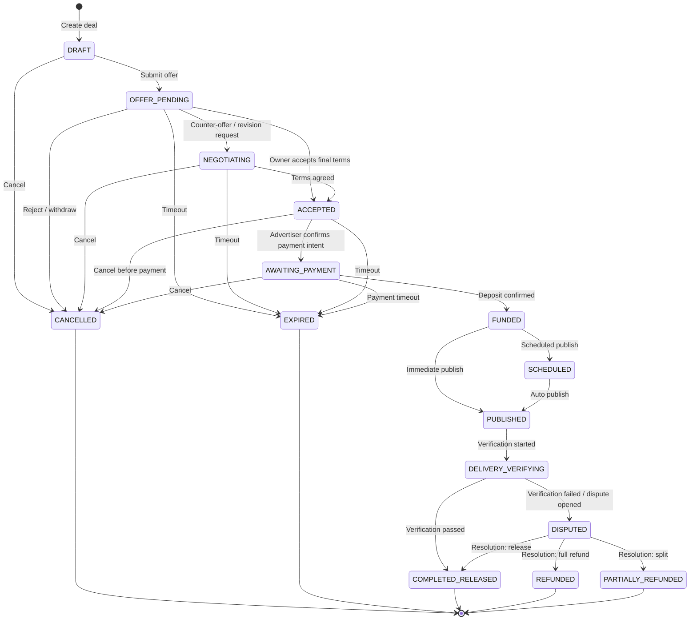

# Deal State Machine

## Overview

The deal lifecycle is governed by a deterministic state machine with an **Approve -> Pay** flow.
Creative approval is part of pre-payment negotiation, not a post-funding loop.

Every transition is:

- Actor-checked: only allowed actor(s) can trigger a transition
- Idempotent: duplicate commands do not produce duplicate side effects
- Event-backed: every transition is appended to `deal_events`

## Canonical Runtime Flow

## Statuses

| Status | Meaning |
|---|---|
| `DRAFT` | Draft offer created by advertiser |
| `OFFER_PENDING` | Offer sent to owner |
| `NEGOTIATING` | Terms/creative/slot negotiation |
| `ACCEPTED` | Owner accepted final terms |
| `AWAITING_PAYMENT` | Payment intent active, waiting for deposit |
| `FUNDED` | Escrow funded |
| `SCHEDULED` | Post scheduled |
| `PUBLISHED` | Post published |
| `DELIVERY_VERIFYING` | Delivery verification window active |
| `DISPUTED` | Dispute in progress |
| `COMPLETED_RELEASED` | Escrow released |
| `CANCELLED` | Deal cancelled |
| `EXPIRED` | Deal expired by timeout |
| `REFUNDED` | Full refund completed |
| `PARTIALLY_REFUNDED` | Partial refund completed |

Removed from runtime flow:

- `CREATIVE_SUBMITTED`
- `CREATIVE_APPROVED`

## Transition Ownership (high-level)

| Transition | Actor |
|---|---|
| `DRAFT -> OFFER_PENDING` | Advertiser |
| `OFFER_PENDING -> ACCEPTED` | Channel owner |
| `OFFER_PENDING -> NEGOTIATING` | Advertiser or owner |
| `NEGOTIATING -> ACCEPTED` | Advertiser or owner |
| `ACCEPTED -> AWAITING_PAYMENT` | Advertiser |
| `AWAITING_PAYMENT -> FUNDED` | System (deposit watcher) |
| `FUNDED -> SCHEDULED/PUBLISHED` | Owner or system scheduler |
| `PUBLISHED -> DELIVERY_VERIFYING` | System |
| `DELIVERY_VERIFYING -> COMPLETED_RELEASED` | System |
| `DELIVERY_VERIFYING -> DISPUTED` | Participants or system verifier |
| `DISPUTED -> *` | Operator |

## Timeout Policy

| Status | Default timeout | Action |
|---|---|---|
| `OFFER_PENDING` | 48h | `EXPIRED` |
| `NEGOTIATING` | 72h | `EXPIRED` |
| `ACCEPTED` | 24h | `EXPIRED` |
| `AWAITING_PAYMENT` | 24h | `EXPIRED` |
| `DELIVERY_VERIFYING` | 24h | Auto release/dispute by verifier outcome |

## Financial Invariants

1. No payment before owner approval (`ACCEPTED`).
2. All outbound TON transfers must be persisted before `sendBoc`.
3. Retry of outbound transfer is forbidden when previous attempt is unresolved.
4. Ledger write path remains idempotent by idempotency keys.

## Concurrency and Races

- State transitions use optimistic locking (`status + version`).
- Financial side effects use distributed lock per deal.
- Typical race handling:
  - `CANCELLED` vs deposit confirm: first successful commit wins.
  - double dispute resolve: second actor gets stale-version failure.

## Related Docs

- [Deal lifecycle feature](./03-feature-specs/02-deal-lifecycle.md)
- [Security and compliance](./10-security-and-compliance.md)
- [Deal workflow engine](./14-implementation-specs/35-deal-workflow-engine.md)
