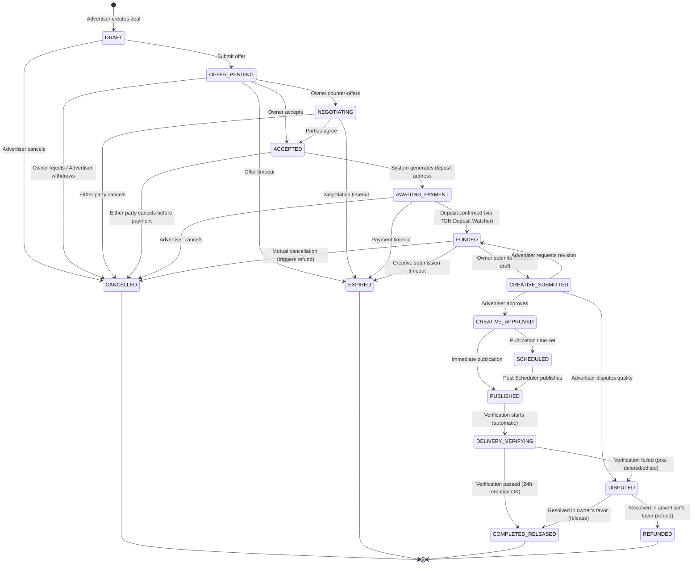

# Deal State Machine

## Overview

The deal lifecycle is governed by a deterministic state machine. Every transition is:

- **Actor-checked** — only authorized actors can trigger specific transitions
- **Idempotent** — duplicate transition attempts are safely ignored
- **Event-emitting** — each transition appends to `deal_events` and publishes to `deal.events` Kafka topic

The state machine is implemented in the **Deal Transition Service** with side-effects orchestrated by the **Deal Workflow Engine**.

## State Diagram



## States

| State | Description | Financial Implication |
|-------|-------------|---------------------|
| `DRAFT` | Deal created, not yet submitted | None |
| `OFFER_PENDING` | Offer sent to channel owner | None |
| `NEGOTIATING` | Parties negotiating terms | None |
| `ACCEPTED` | Terms agreed, awaiting payment setup | None |
| `AWAITING_PAYMENT` | Deposit address generated, waiting for TON | None |
| `FUNDED` | Escrow funded, creative workflow begins | `ESCROW:{deal_id}` credited |
| `CREATIVE_SUBMITTED` | Creative draft submitted for review | Escrow held |
| `CREATIVE_APPROVED` | Creative approved by advertiser | Escrow held |
| `SCHEDULED` | Publication scheduled at specific time | Escrow held |
| `PUBLISHED` | Creative published to channel | Escrow held |
| `DELIVERY_VERIFYING` | 24h retention verification in progress | Escrow held |
| `COMPLETED_RELEASED` | Delivery verified, payout sent | Escrow released, commission deducted |
| `DISPUTED` | Dispute opened, under review | Escrow frozen |
| `CANCELLED` | Deal cancelled | Refund if previously funded |
| `REFUNDED` | Escrow refunded after dispute | Escrow returned to advertiser |
| `EXPIRED` | Deal expired due to timeout | Refund if previously funded |

## Transitions

### Pre-Payment Transitions

| From | To | Trigger | Actor | Side Effects |
|------|----|---------|-------|-------------|
| `DRAFT` | `OFFER_PENDING` | Submit offer | Advertiser | Notify channel owner |
| `DRAFT` | `CANCELLED` | Cancel | Advertiser | None |
| `OFFER_PENDING` | `NEGOTIATING` | Counter-offer | Channel Owner | Notify advertiser |
| `OFFER_PENDING` | `ACCEPTED` | Accept | Channel Owner | Generate deposit address, notify advertiser |
| `OFFER_PENDING` | `CANCELLED` | Reject/Withdraw | Owner/Advertiser | Notify other party |
| `OFFER_PENDING` | `EXPIRED` | Timeout | System (Deal Timeout Worker) | Notify both parties |
| `NEGOTIATING` | `ACCEPTED` | Agree | Either | Generate deposit address |
| `NEGOTIATING` | `CANCELLED` | Cancel | Either | Notify other party |
| `NEGOTIATING` | `EXPIRED` | Timeout | System | Notify both parties |
| `ACCEPTED` | `AWAITING_PAYMENT` | System auto | System | Deposit address ready |
| `ACCEPTED` | `CANCELLED` | Cancel | Either | Notify other party |

### Payment Transitions

| From | To | Trigger | Actor | Side Effects |
|------|----|---------|-------|-------------|
| `AWAITING_PAYMENT` | `FUNDED` | Deposit confirmed | System (TON Deposit Watcher) | Ledger: debit `EXTERNAL_TON`, credit `ESCROW:{deal_id}` |
| `AWAITING_PAYMENT` | `CANCELLED` | Cancel | Advertiser | Notify owner |
| `AWAITING_PAYMENT` | `EXPIRED` | Payment timeout | System | Notify both parties |

### Creative & Delivery Transitions

| From | To | Trigger | Actor | Side Effects |
|------|----|---------|-------|-------------|
| `FUNDED` | `CREATIVE_SUBMITTED` | Submit draft | Channel Owner/Admin | Notify advertiser |
| `FUNDED` | `CANCELLED` | Mutual cancel | Both | Trigger refund |
| `FUNDED` | `EXPIRED` | Creative timeout | System | Trigger refund |
| `CREATIVE_SUBMITTED` | `CREATIVE_APPROVED` | Approve | Advertiser | Notify owner, enable publishing |
| `CREATIVE_SUBMITTED` | `FUNDED` | Request revision | Advertiser | Notify owner |
| `CREATIVE_SUBMITTED` | `DISPUTED` | Dispute quality | Advertiser | Freeze escrow |
| `CREATIVE_APPROVED` | `SCHEDULED` | Set publish time | Owner/Admin | Schedule via Post Scheduler |
| `CREATIVE_APPROVED` | `PUBLISHED` | Publish now | Owner/Admin | Post Scheduler publishes |
| `SCHEDULED` | `PUBLISHED` | Auto-publish | System (Post Scheduler) | Verify via callback |
| `PUBLISHED` | `DELIVERY_VERIFYING` | Auto-start | System | Start 24h verification |

### Completion Transitions

| From | To | Trigger | Actor | Side Effects |
|------|----|---------|-------|-------------|
| `DELIVERY_VERIFYING` | `COMPLETED_RELEASED` | Verification passed | System (Delivery Verifier) | Release escrow, deduct commission, execute payout |
| `DELIVERY_VERIFYING` | `DISPUTED` | Verification failed | System | Freeze escrow, notify both |
| `DISPUTED` | `COMPLETED_RELEASED` | Resolve for owner | Platform Operator | Release escrow, execute payout |
| `DISPUTED` | `REFUNDED` | Resolve for advertiser | Platform Operator | Execute refund |

## Timeouts

Each state has a configurable deadline. The **Deal Timeout Worker** consumes `deal.deadlines` Kafka topic and auto-transitions expired deals.

| State | Default Timeout | Action on Expiry |
|-------|----------------|-----------------|
| `OFFER_PENDING` | 48 hours | → `EXPIRED` |
| `NEGOTIATING` | 72 hours | → `EXPIRED` |
| `AWAITING_PAYMENT` | 24 hours | → `EXPIRED` |
| `FUNDED` | 72 hours | → `EXPIRED` + refund |
| `CREATIVE_SUBMITTED` | 48 hours | → `EXPIRED` + refund |
| `DELIVERY_VERIFYING` | 24 hours | → `COMPLETED_RELEASED` (auto-approve) |

## Event Storage

Every transition is recorded in `deal_events`:

| Column | Type | Description |
|--------|------|-------------|
| `event_id` | `UUID` | Unique event identifier |
| `deal_id` | `UUID` | Deal aggregate reference |
| `event_type` | `VARCHAR` | Transition type (e.g., `FUNDED`, `DISPUTED`) |
| `from_status` | `VARCHAR` | Previous state |
| `to_status` | `VARCHAR` | New state |
| `actor_id` | `BIGINT` | User who triggered (NULL for system) |
| `payload` | `JSONB` | Additional event data |
| `created_at` | `TIMESTAMPTZ` | Event timestamp |

Table is **partitioned by `created_at`** for efficient range queries and archival.

## Concurrency Control & Race Conditions

### Problem

Concurrent state transitions могут привести к невалидным состояниям:
- Два worker'а одновременно пытаются перевести deal в разные состояния
- Advertiser отменяет deal одновременно с подтверждением deposit'а
- Два оператора одновременно разрешают dispute в разные стороны

### Strategy: Optimistic Locking + Status Guard

**Уровень 1: Optimistic Locking (DB)**

```sql
-- deals table has version column for optimistic locking
ALTER TABLE deals ADD COLUMN version INTEGER NOT NULL DEFAULT 0;

-- Transition query:
UPDATE deals
SET status = :newStatus,
    version = version + 1,
    updated_at = NOW()
WHERE id = :dealId
  AND status = :expectedCurrentStatus
  AND version = :expectedVersion;
-- If rows_updated == 0: concurrent modification detected
```

```java
public DealTransitionResult transition(UUID dealId, DealStatus expectedFrom,
                                        DealStatus to, Long actorId) {
    int updated = dsl.update(DEALS)
        .set(DEALS.STATUS, to.name())
        .set(DEALS.VERSION, DEALS.VERSION.plus(1))
        .set(DEALS.UPDATED_AT, DSL.now())
        .where(DEALS.ID.eq(dealId))
        .and(DEALS.STATUS.eq(expectedFrom.name()))
        .and(DEALS.VERSION.eq(expectedVersion))
        .execute();

    if (updated == 0) {
        // Reload and check
        var current = dsl.select(DEALS.STATUS, DEALS.VERSION)
            .from(DEALS).where(DEALS.ID.eq(dealId)).fetchOne();
        if (current.get(DEALS.STATUS).equals(to.name())) {
            return DealTransitionResult.ALREADY_IN_TARGET_STATE; // idempotent
        }
        throw new ConcurrentModificationException("Deal " + dealId);
    }
    return DealTransitionResult.SUCCESS;
}
```

**Уровень 2: Redis Distributed Lock (для long-running operations)**

Для операций с side effects (payout, refund), где нужно гарантировать, что только один процесс выполняет операцию:

```
Lock key: lock:deal:{dealId}:transition
TTL: 30 seconds
```

Используется для:
- Payout execution (TX build + submit)
- Refund execution
- Deposit confirmation + ledger entry creation

НЕ используется для:
- Простые status transitions (optimistic locking достаточно)
- Read operations

**Уровень 3: Database Transaction Isolation**

```yaml
spring:
  jpa:
    properties:
      hibernate:
        default_batch_fetch_size: 10
  datasource:
    hikari:
      transaction-isolation: TRANSACTION_READ_COMMITTED
```

`READ COMMITTED` — достаточно для optimistic locking. `SERIALIZABLE` избыточен и создаёт contention.

### Race Condition Scenarios & Resolutions

| Scenario | Detection | Resolution |
|----------|-----------|------------|
| Advertiser cancels + deposit confirms simultaneously | Optimistic lock conflict | Whoever commits first wins. If CANCELLED first — deposit triggers refund. If FUNDED first — cancel rejected (already funded). |
| Two operators resolve dispute differently | Optimistic lock on version | Second update gets 0 rows, returns ConcurrentModificationException |
| Duplicate deposit confirmation (Kafka retry) | Idempotency key `deposit:{tx_hash}` | Second processing skipped |
| Timeout worker fires during manual transition | Status guard in UPDATE WHERE | Timeout sees wrong status, no-op |
| Multiple outbox pollers pick same record | `FOR UPDATE SKIP LOCKED` | Only one poller processes each record |

### Idempotency at Transition Level

Каждый transition проверяет: если deal уже в target state — возвращает success (idempotent), а не ошибку. Это критически важно для Kafka consumer retries.

---

## Related Documents

- [Deal Lifecycle Feature Spec](./03-feature-specs/02-deal-lifecycle.md)
- [State Machine Pattern](./05-patterns-and-decisions/04-state-machine.md)
- [Escrow Payments](./03-feature-specs/04-escrow-payments.md)
- [Dispute Resolution](./03-feature-specs/06-dispute-resolution.md)
- [Workers](./04-architecture/04-workers.md)
- [Redis Distributed Locks](./14-implementation-specs/09-redis-distributed-locks.md)
