# Financial System: Escrow Flow

## Overview

The escrow flow covers the complete lifecycle of funds — from deposit address generation to final payout or refund. This document details the financial mechanics at each stage.

## End-to-End Flow

```mermaid
flowchart TB
    subgraph "1. Address Generation"
        A1[Deal accepted] --> A2[Escrow Service]
        A2 --> A3[TON Payment Gateway]
        A3 --> A4[TON Center API: generate address]
        A4 --> A5[Store deposit_address in deal]
    end

    subgraph "2. Deposit Detection"
        B1[Advertiser sends TON] --> B2[TON Blockchain]
        B3[TON Deposit Watcher polls] --> B2
        B3 --> B4{Confirmation Policy}
        B4 -->|Confirmed| B5[Worker Callback: deposit_confirmed]
    end

    subgraph "3. Escrow Hold"
        C1[Deal Transition: FUNDED] --> C2[Ledger Entry]
        C2 --> C3[Debit EXTERNAL_TON]
        C2 --> C4[Credit ESCROW:deal_id]
        C4 --> C5[Balance Projection updates]
    end

    subgraph "4a. Release (Happy Path)"
        D1[Delivery verified] --> D2[Commission calculation]
        D2 --> D3[Debit ESCROW:deal_id]
        D2 --> D4[Credit COMMISSION:deal_id - 10%]
        D2 --> D5[Credit OWNER_PENDING:owner_id - 90%]
        D5 --> D6[Payout Executor]
        D6 --> D7[TON transfer to owner]
    end

    subgraph "4b. Refund"
        E1[Dispute resolved / Cancelled] --> E2[Debit ESCROW:deal_id]
        E2 --> E3[Credit EXTERNAL_TON]
        E3 --> E4[Refund Executor]
        E4 --> E5[TON transfer to advertiser]
    end
```

## Stage 1: Address Generation

**Trigger**: Deal transitions to `ACCEPTED`

1. Deal Workflow Engine calls Escrow Service
2. Escrow Service calls TON Payment Gateway
3. TON Payment Gateway generates unique deposit address via TON Center API
4. Address stored in `deals.deposit_address`
5. Expected amount stored in `deals.amount_nano`

**Key property**: Each deal gets a **unique deposit address** for clear attribution.

## Stage 2: Deposit Detection

**Trigger**: Advertiser sends TON to deposit address

1. TON Deposit Watcher polls TON Center API (`GET account transactions`)
2. Detects incoming transaction to the deposit address
3. Records in `ton_transactions`:
   - `tx_hash` (PK — idempotency key)
   - `direction: IN`
   - `amount_nano`
   - `deal_id`
4. Applies [Confirmation Policy](./06-confirmation-policy.md) (tiered by amount)
5. After required confirmations, sends callback to Backend API

## Stage 3: Escrow Hold

**Trigger**: Worker callback with `deposit_confirmed`

1. Deal Transition Service validates: `status == AWAITING_PAYMENT`
2. Begins database transaction:
   - `UPDATE deals SET status = 'FUNDED', funded_at = NOW(), deposit_tx_hash = ?`
   - `INSERT INTO deal_events (FUNDED event)`
   - `INSERT INTO ledger_entries (debit EXTERNAL_TON, credit ESCROW:{deal_id})`
   - `INSERT INTO audit_log`
   - `INSERT INTO notification_outbox`
3. Commits transaction
4. Balance Projection updates `account_balances` and Redis cache

**Escrow account**: `ESCROW:{deal_id}` now holds the full deal amount.

## Stage 4a: Release (Happy Path)

**Trigger**: Delivery verification passes

1. Deal Transition Service validates: `status == DELIVERY_VERIFYING`
2. Deal Workflow Engine calls Escrow Service to release
3. Escrow Service calls Ledger Service:
   - Ledger Service calls Commission Service for 10% calculation
   - Creates ledger entries (3 entries, 1 `tx_ref`):
     - Debit `ESCROW:{deal_id}` — full amount
     - Credit `COMMISSION:{deal_id}` — 10%
     - Credit `OWNER_PENDING:{owner_id}` — 90%
4. Records to `audit_log`
5. Publishes payout command to `escrow.commands`
6. Payout Executor:
   - Acquires Redis lock `lock:payout:{deal_id}`
   - Submits TON transaction via TON Center API
   - Records in `ton_transactions` (`direction: OUT`)
   - Sends callback: `payout_completed (tx_hash)`
7. Deal transitions to `COMPLETED_RELEASED`

## Stage 4b: Refund

**Trigger**: Dispute resolved in advertiser's favor, or deal cancelled while funded

1. Creates ledger entries:
   - Debit `ESCROW:{deal_id}` — full amount
   - Credit `EXTERNAL_TON` — refund amount
2. Publishes refund command to `escrow.commands`
3. Refund Executor:
   - Acquires Redis lock `lock:refund:{deal_id}`
   - Submits TON refund transaction
   - Records in `ton_transactions` (`direction: OUT`)
   - Sends callback: `refund_completed (tx_hash)`
4. Deal transitions to `REFUNDED`

## Financial Invariants

| Invariant | Check |
|-----------|-------|
| Debit = Credit per tx_ref | Enforced on write, verified by reconciliation |
| Escrow balance >= 0 | Checked before release/refund |
| One release OR one refund per deal | State machine prevents double execution |
| Payout + Commission = Escrow amount | Verified on release |

## Related Documents

- [Ledger Design](./01-ledger-design.md) — entry structure
- [Commission Model](./03-commission-model.md) — 10% calculation
- [Confirmation Policy](./06-confirmation-policy.md) — tiered confirmations
- [Account Types](./05-account-types.md) — account identifiers
- [Reconciliation](./04-reconciliation.md) — invariant verification
- [Escrow Payments Feature](../03-feature-specs/04-escrow-payments.md) — user-facing spec
