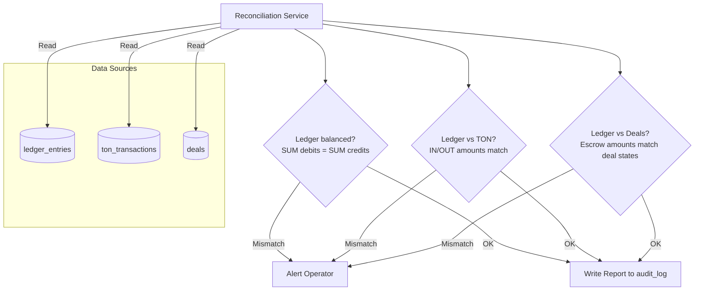
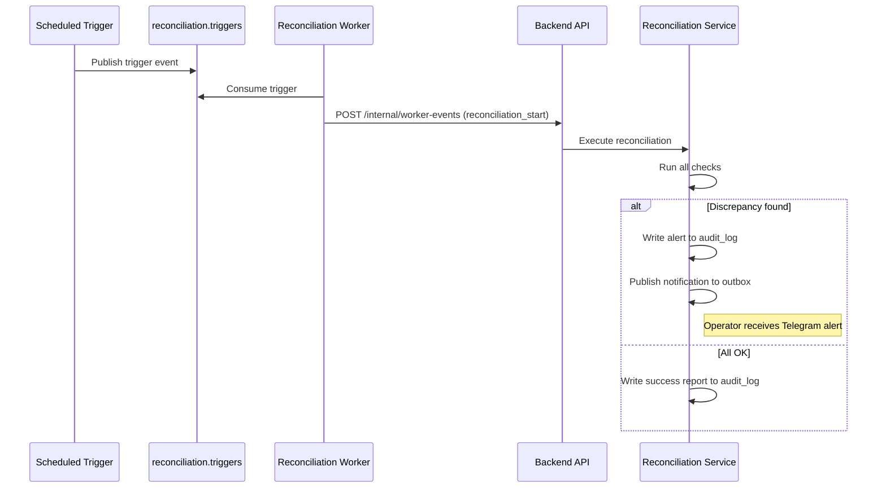

# Financial System: Reconciliation

## Overview

Reconciliation is a periodic three-way comparison that ensures consistency between the platform's internal ledger, the TON blockchain, and deal aggregates. It is the financial safety net — detecting any discrepancies before they become problems.

## Three-Way Reconciliation



## Reconciliation Checks

### Check 1: Ledger Self-Balance

**Invariant**: `SUM(all DEBIT amounts) = SUM(all CREDIT amounts)`

```sql
SELECT
    SUM(CASE WHEN direction = 'DEBIT' THEN amount_nano ELSE 0 END) AS total_debits,
    SUM(CASE WHEN direction = 'CREDIT' THEN amount_nano ELSE 0 END) AS total_credits
FROM ledger_entries;
-- total_debits MUST equal total_credits
```

Also per-transaction: for each `tx_ref`, debits = credits.

### Check 2: Ledger vs TON Blockchain

Compares internal records against blockchain reality:

| Check | Ledger Source | Blockchain Source |
|-------|-------------|------------------|
| Total deposits IN | SUM of `EXTERNAL_TON` DEBIT entries | SUM of `ton_transactions` where `direction = IN` |
| Total payouts OUT | SUM of `EXTERNAL_TON` CREDIT entries (payouts) | SUM of `ton_transactions` where `direction = OUT` and type = PAYOUT |
| Total refunds OUT | SUM of `EXTERNAL_TON` CREDIT entries (refunds) | SUM of `ton_transactions` where `direction = OUT` and type = REFUND |

### Check 3: Ledger vs Deal Aggregates

For each deal in a financial state:

| Deal Status | Expected Ledger State |
|-------------|----------------------|
| `FUNDED` | `ESCROW:{deal_id}` balance = `deal.amount_nano` |
| `COMPLETED_RELEASED` | `ESCROW:{deal_id}` balance = 0, payout entries exist |
| `REFUNDED` | `ESCROW:{deal_id}` balance = 0, refund entries exist |
| `CANCELLED` (was funded) | `ESCROW:{deal_id}` balance = 0, refund entries exist |

### Check 4: Account Balance Projection

Verifies CQRS read model consistency:

```sql
-- For each account, verify materialized balance matches ledger
SELECT account_id,
    (SELECT SUM(CASE WHEN direction='CREDIT' THEN amount_nano ELSE -amount_nano END)
     FROM ledger_entries WHERE account_id = ab.account_id) AS calculated,
    ab.balance_nano AS materialized
FROM account_balances ab
WHERE calculated != materialized;
-- Should return 0 rows
```

## Trigger Mechanism



**Schedule**: Configurable (recommended: every 6 hours in MVP, hourly in Scaled).

## Reconciliation Exclusion Lock

Uses Redis distributed lock `lock:reconciliation` (TTL 300s) to prevent concurrent reconciliation runs.

## Discrepancy Handling

| Severity | Condition | Action |
|----------|-----------|--------|
| **Critical** | Ledger imbalanced (debits != credits) | Immediate operator alert, pause financial operations |
| **High** | Ledger vs TON mismatch | Operator alert, investigate within 1 hour |
| **Medium** | Ledger vs deal state mismatch | Operator alert, investigate within 24 hours |
| **Low** | CQRS projection drift | Auto-correct projection, log event |

## Components Involved

| Component | Role |
|-----------|------|
| **Reconciliation Service** | Reads all three sources, performs checks, writes reports |
| **Reconciliation Worker** | Periodic trigger consumer |
| **audit_log** | Stores reconciliation reports |
| **Bot Notifier** | Delivers alerts to operator |

## Related Documents

- [Ledger Design](./01-ledger-design.md) — ledger structure
- [Double-Entry Ledger](../05-patterns-and-decisions/05-double-entry-ledger.md) — invariant principle
- [CQRS](../05-patterns-and-decisions/02-cqrs.md) — projection verification
- [Workers](../04-architecture/04-workers.md) — Reconciliation Worker
- [Security & Compliance](../10-security-and-compliance.md) — audit requirements
