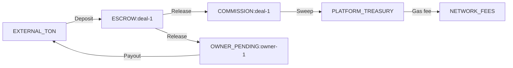

# Financial System: Account Types

## Overview

The double-entry ledger uses string-based account identifiers. Each account type represents a distinct financial role in the system. All balances are materialized in `account_balances` and cached in Redis.

## Account Types

### PLATFORM_TREASURY

| Attribute | Value |
|-----------|-------|
| **Format** | `PLATFORM_TREASURY` |
| **Cardinality** | Singleton |
| **Purpose** | Platform's accumulated commission revenue |
| **Credited by** | Commission sweep from per-deal commission accounts |
| **Debited by** | Network fee payments, platform withdrawals (future) |

### ESCROW:{deal_id}

| Attribute | Value |
|-----------|-------|
| **Format** | `ESCROW:{deal_id}` (e.g., `ESCROW:550e8400-e29b-41d4-a716-446655440000`) |
| **Cardinality** | One per deal |
| **Purpose** | Holds advertiser's funds during deal execution |
| **Credited by** | Deposit confirmation (from `EXTERNAL_TON`) |
| **Debited by** | Release (to `COMMISSION` + `OWNER_PENDING`) or Refund (to `EXTERNAL_TON`) |
| **Lifecycle** | Created on funding, zeroed on release/refund |

**Invariant**: Balance must be >= 0 at all times. Balance = 0 when deal is completed or refunded.

### OWNER_PENDING:{user_id}

| Attribute | Value |
|-----------|-------|
| **Format** | `OWNER_PENDING:{user_id}` (e.g., `OWNER_PENDING:123456789`) |
| **Cardinality** | One per channel owner |
| **Purpose** | Channel owner's pending payout balance |
| **Credited by** | Escrow release (owner's share after commission) |
| **Debited by** | Payout execution (TON transfer to owner) |

### COMMISSION:{deal_id}

| Attribute | Value |
|-----------|-------|
| **Format** | `COMMISSION:{deal_id}` (e.g., `COMMISSION:550e8400-...`) |
| **Cardinality** | One per completed deal |
| **Purpose** | Per-deal commission tracking |
| **Credited by** | Escrow release (commission portion) |
| **Debited by** | Commission sweep to `PLATFORM_TREASURY` |

### EXTERNAL_TON

| Attribute | Value |
|-----------|-------|
| **Format** | `EXTERNAL_TON` |
| **Cardinality** | Singleton |
| **Purpose** | Virtual account representing external TON blockchain |
| **Debited by** | Deposit received (money enters the system) |
| **Credited by** | Payout/refund sent (money leaves the system) |

This is a **contra account** — its balance is typically **negative**, representing the net TON held by the platform on behalf of users.

> **Note**: `account_balances.balance_nano` does NOT have a `CHECK >= 0` constraint (removed in 006-financial-fixes.sql) specifically to allow EXTERNAL_TON to go negative.

### NETWORK_FEES

| Attribute | Value |
|-----------|-------|
| **Format** | `NETWORK_FEES` |
| **Cardinality** | Singleton |
| **Purpose** | Tracks cumulative TON gas fees spent on outbound transactions |
| **Credited by** | Fee recording after confirmed TX |
| **Normal balance** | Credit (expense account) |

See [NETWORK_FEES Account](./08-network-fees-account.md) for details.

### OVERPAYMENT:{deal_id}

| Attribute | Value |
|-----------|-------|
| **Format** | `OVERPAYMENT:{deal_id}` (e.g., `OVERPAYMENT:550e8400-...`) |
| **Cardinality** | One per deal with overpayment |
| **Purpose** | Holds excess funds when advertiser overpays |
| **Credited by** | Overpayment detection (amount above deal price) |
| **Debited by** | Overpayment refund to advertiser |

See [Overpayment & Underpayment](../14-implementation-specs/31-overpayment-underpayment.md) for details.

### PARTIAL_DEPOSIT:{deal_id}

| Attribute | Value |
|-----------|-------|
| **Format** | `PARTIAL_DEPOSIT:{deal_id}` (e.g., `PARTIAL_DEPOSIT:550e8400-...`) |
| **Cardinality** | One per deal with underpayment |
| **Purpose** | Tracks partial deposits before deal is fully funded |
| **Credited by** | Each partial deposit received |
| **Debited by** | Promotion to ESCROW (when cumulative >= expected) or refund (on cancel/timeout) |
| **Lifecycle** | Created on first partial deposit, zeroed when promoted to ESCROW or refunded |

See [Overpayment & Underpayment](../14-implementation-specs/31-overpayment-underpayment.md) for details.

### LATE_DEPOSIT:{deal_id}

| Attribute | Value |
|-----------|-------|
| **Format** | `LATE_DEPOSIT:{deal_id}` |
| **Cardinality** | One per late deposit event |
| **Purpose** | Temporary holding for deposits to expired/cancelled deals |
| **Credited by** | Late deposit detection |
| **Debited by** | Automatic refund to advertiser |
| **Lifecycle** | Created and zeroed within same operation (transient) |

See [Late Deposit Handling](../14-implementation-specs/39-late-deposit-handling.md) for details.

## Account Lifecycle per Deal



### Happy Path Balances

| Event | EXTERNAL_TON | ESCROW:deal | COMMISSION:deal | OWNER_PENDING:owner | PLATFORM_TREASURY | NETWORK_FEES |
|-------|:---:|:---:|:---:|:---:|:---:|:---:|
| Start | 0 | 0 | 0 | 0 | 0 | 0 |
| Deposit 1000 TON | -1000 | +1000 | 0 | 0 | 0 | 0 |
| Release | -1000 | 0 | +100 | +900 | 0 | 0 |
| Payout | -100 | 0 | +100 | 0 | 0 | +0.005 |
| Commission sweep | -100 | 0 | 0 | 0 | +100 | +0.01 |
| Platform withdrawal | 0 | 0 | 0 | 0 | 0 | +0.01 |

### Refund Path Balances

| Event | EXTERNAL_TON | ESCROW:deal | NETWORK_FEES |
|-------|:---:|:---:|:---:|
| Deposit 1000 TON | -1000 | +1000 | 0 |
| Refund | -0.005 | 0 | +0.005 |

## account_balances Table (matches DDL)

Materialized read model projecting current balance per account:

```sql
CREATE TABLE account_balances (
    account_id      VARCHAR(100) PRIMARY KEY,
    balance_nano    BIGINT NOT NULL DEFAULT 0,  -- NO CHECK >= 0 (contra accounts go negative)
    last_entry_id   BIGINT NOT NULL DEFAULT 0,
    version         INTEGER NOT NULL DEFAULT 0,
    updated_at      TIMESTAMPTZ DEFAULT now()
);
```

Cached in Redis as `balance:{account_id}`.

## Non-Negative Enforcement

The `CHECK(balance_nano >= 0)` constraint was removed from DDL to support contra accounts. Non-negative balance is enforced at **application level** for these account types:

| Account Type | Balance Constraint |
|-------------|-------------------|
| ESCROW:{deal_id} | >= 0 (application-enforced) |
| OWNER_PENDING:{user_id} | >= 0 (application-enforced) |
| COMMISSION:{deal_id} | >= 0 (application-enforced) |
| PLATFORM_TREASURY | >= 0 (application-enforced) |
| PARTIAL_DEPOSIT:{deal_id} | >= 0 (application-enforced) |
| OVERPAYMENT:{deal_id} | >= 0 (application-enforced) |
| LATE_DEPOSIT:{deal_id} | >= 0 (application-enforced, transient) |
| EXTERNAL_TON | **Can be negative** (contra account) |
| NETWORK_FEES | **Can be negative** (expense account) |

## Related Documents

- [Ledger Design](./01-ledger-design.md) — entry structure and examples
- [Entry Type Catalog](./07-entry-type-catalog.md) — complete entry_type enumeration
- [NETWORK_FEES Account](./08-network-fees-account.md) — gas fee tracking
- [Commission Model](./03-commission-model.md) — commission calculation
- [Escrow Flow](./02-escrow-flow.md) — complete flow
- [CQRS](../05-patterns-and-decisions/02-cqrs.md) — read model projection
- [Glossary](../13-glossary.md) — term definitions
