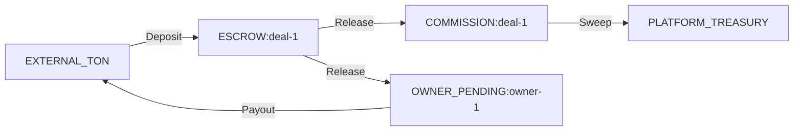

# Financial System: Account Types

## Overview

The double-entry ledger uses string-based account identifiers. Each account type represents a distinct financial role in the system. All balances are materialized in `account_balances` and cached in Redis.

## Account Types

### PLATFORM_TREASURY

| Attribute | Value |
|-----------|-------|
| **Format** | `PLATFORM_TREASURY` |
| **Cardinality** | Singleton |
| **Purpose** | Platform's accumulated commission revenue |
| **Credited by** | Commission sweep from per-deal commission accounts |
| **Debited by** | Platform withdrawals (future) |

### ESCROW:{deal_id}

| Attribute | Value |
|-----------|-------|
| **Format** | `ESCROW:{deal_id}` (e.g., `ESCROW:550e8400-e29b-41d4-a716-446655440000`) |
| **Cardinality** | One per deal |
| **Purpose** | Holds advertiser's funds during deal execution |
| **Credited by** | Deposit confirmation (from `EXTERNAL_TON`) |
| **Debited by** | Release (to `COMMISSION` + `OWNER_PENDING`) or Refund (to `EXTERNAL_TON`) |
| **Lifecycle** | Created on funding, zeroed on release/refund |

**Invariant**: Balance must be >= 0 at all times. Balance = 0 when deal is completed or refunded.

### OWNER_PENDING:{user_id}

| Attribute | Value |
|-----------|-------|
| **Format** | `OWNER_PENDING:{user_id}` (e.g., `OWNER_PENDING:123456789`) |
| **Cardinality** | One per channel owner |
| **Purpose** | Channel owner's pending payout balance |
| **Credited by** | Escrow release (90% of deal amount) |
| **Debited by** | Payout execution (TON transfer to owner) |

### COMMISSION:{deal_id}

| Attribute | Value |
|-----------|-------|
| **Format** | `COMMISSION:{deal_id}` (e.g., `COMMISSION:550e8400-...`) |
| **Cardinality** | One per completed deal |
| **Purpose** | Per-deal commission tracking |
| **Credited by** | Escrow release (10% of deal amount) |
| **Debited by** | Commission sweep to `PLATFORM_TREASURY` |

### EXTERNAL_TON

| Attribute | Value |
|-----------|-------|
| **Format** | `EXTERNAL_TON` |
| **Cardinality** | Singleton |
| **Purpose** | Virtual account representing external TON blockchain |
| **Debited by** | Deposit received (money enters the system) |
| **Credited by** | Payout/refund sent (money leaves the system) |

This is a **contra account** — its balance represents the net TON held by the platform on behalf of users.

## Account Lifecycle per Deal



### Happy Path Balances

| Event | EXTERNAL_TON | ESCROW:deal | COMMISSION:deal | OWNER_PENDING:owner | PLATFORM_TREASURY |
|-------|:---:|:---:|:---:|:---:|:---:|
| Start | 0 | 0 | 0 | 0 | 0 |
| Deposit 1000 TON | -1000 | +1000 | 0 | 0 | 0 |
| Release | -1000 | 0 | +100 | +900 | 0 |
| Payout | -100 | 0 | +100 | 0 | 0 |
| Commission sweep | -100 | 0 | 0 | 0 | +100 |
| Platform withdrawal | 0 | 0 | 0 | 0 | 0 |

### Refund Path Balances

| Event | EXTERNAL_TON | ESCROW:deal |
|-------|:---:|:---:|
| Deposit 1000 TON | -1000 | +1000 |
| Refund | 0 | 0 |

## account_balances Table

Materialized read model projecting current balance per account:

```sql
CREATE TABLE account_balances (
    account_id      VARCHAR(200) PRIMARY KEY,
    balance_nano    BIGINT NOT NULL DEFAULT 0,
    last_entry_id   UUID,
    updated_at      TIMESTAMPTZ NOT NULL DEFAULT NOW()
);
```

Cached in Redis as `balance:{account_id}`.

## Related Documents

- [Ledger Design](./01-ledger-design.md) — entry structure and examples
- [Commission Model](./03-commission-model.md) — commission calculation
- [Escrow Flow](./02-escrow-flow.md) — complete flow
- [CQRS](../05-patterns-and-decisions/02-cqrs.md) — read model projection
- [Glossary](../13-glossary.md) — term definitions
