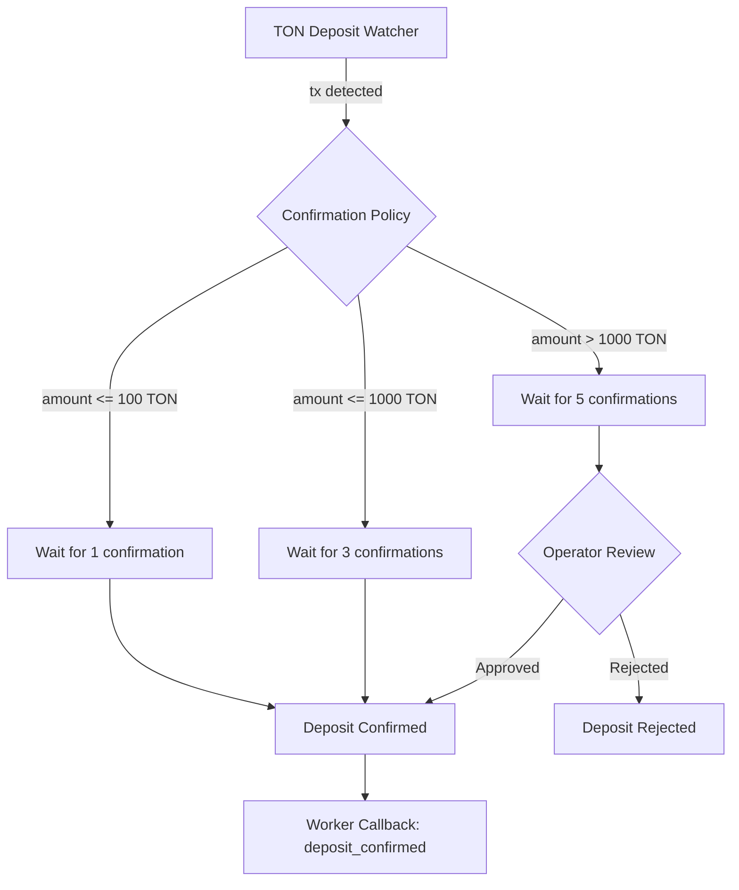

# Financial System: Confirmation Policy

## Overview

The Confirmation Policy defines how many TON blockchain confirmations are required before a deposit is considered final. Higher-value deposits require more confirmations to mitigate fraud risk.

## Tiered Policy

| Amount Range | Required Confirmations | Additional Review |
|-------------|:---:|---|
| <= 100 TON | 1 | None |
| <= 1,000 TON | 3 | None |
| > 1,000 TON | 5 | Operator review required |

## Implementation

The **Confirmation Policy** service is called by the **Escrow Service** when the TON Deposit Watcher detects an incoming transaction.

### Flow

### Confirmation Tracking

The TON Deposit Watcher polls for new blocks and counts confirmations:

1. Transaction detected in block N
2. Current block height = N + K
3. Confirmations = K
4. If K >= required → proceed to confirmation or operator review

For implementation details (operator review flow, amount validation, configuration, block height tracking): see [Confirmation Policy Implementation](../14-implementation-specs/15-confirmation-policy.md).

## Related Documents

- [Confirmation Policy Implementation](../14-implementation-specs/15-confirmation-policy.md) — full implementation spec
- [Escrow Flow](./02-escrow-flow.md) — deposit detection stage
- [Escrow Payments Feature](../03-feature-specs/04-escrow-payments.md) — user-facing spec
- [Workers — TON Deposit Watcher](../04-architecture/04-workers.md)
