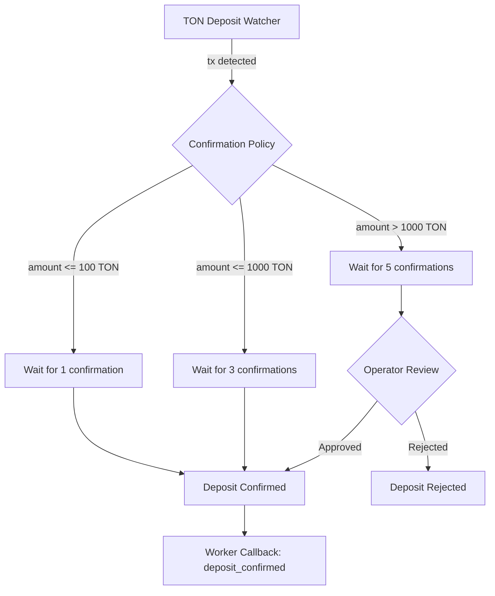

# Financial System: Confirmation Policy

## Overview

The Confirmation Policy defines how many TON blockchain confirmations are required before a deposit is considered final. Higher-value deposits require more confirmations to mitigate fraud risk.

## Tiered Policy

| Amount Range | Required Confirmations | Additional Review |
|-------------|:---:|---|
| <= 100 TON | 1 | None |
| <= 1,000 TON | 3 | None |
| > 1,000 TON | 5 | Operator review required |

## Implementation

The **Confirmation Policy** service is called by the **Escrow Service** when the TON Deposit Watcher detects an incoming transaction.

### Flow

### Confirmation Tracking

The TON Deposit Watcher polls for new blocks and counts confirmations:

1. Transaction detected in block N
2. Current block height = N + K
3. Confirmations = K
4. If K >= required → proceed to confirmation or operator review

### Operator Review (High Value)

For transactions > 1000 TON:

1. After 5 confirmations, notification sent to Platform Operator
2. Operator reviews transaction details:
   - Source address
   - Amount matches expected `deal.amount_nano`
   - No suspicious patterns
3. Operator approves or rejects via Backend API
4. On approval → deposit confirmed, deal transitions to `FUNDED`
5. On rejection → deposit flagged, manual resolution required

## Configuration

| Parameter | Default | Configurable |
|-----------|---------|:---:|
| Tier 1 threshold | 100 TON | Y |
| Tier 1 confirmations | 1 | Y |
| Tier 2 threshold | 1,000 TON | Y |
| Tier 2 confirmations | 3 | Y |
| Tier 3 confirmations | 5 | Y |
| Operator review threshold | 1,000 TON | Y |
| Polling interval | 10 seconds | Y |

## Amount Validation

The Deposit Watcher also validates the deposited amount:

| Check | Condition | Action |
|-------|-----------|--------|
| Exact match | `tx.amount == deal.amount_nano` | Normal confirmation flow |
| Overpayment | `tx.amount > deal.amount_nano` | Flag for operator review |
| Underpayment | `tx.amount < deal.amount_nano` | Do not confirm, notify advertiser |
| Multiple deposits | Second tx to same address | Flag for operator review |

## Component

| Attribute | Value |
|-----------|-------|
| **Service** | Confirmation Policy |
| **Tags** | `#financial` |
| **Called by** | Escrow Service |
| **Consumed by** | TON Deposit Watcher (policy check during polling) |

## Related Documents

- [Escrow Flow](./02-escrow-flow.md) — deposit detection stage
- [Escrow Payments Feature](../03-feature-specs/04-escrow-payments.md) — user-facing spec
- [Workers — TON Deposit Watcher](../04-architecture/04-workers.md)
- [Security & Compliance](../10-security-and-compliance.md) — fraud mitigation
