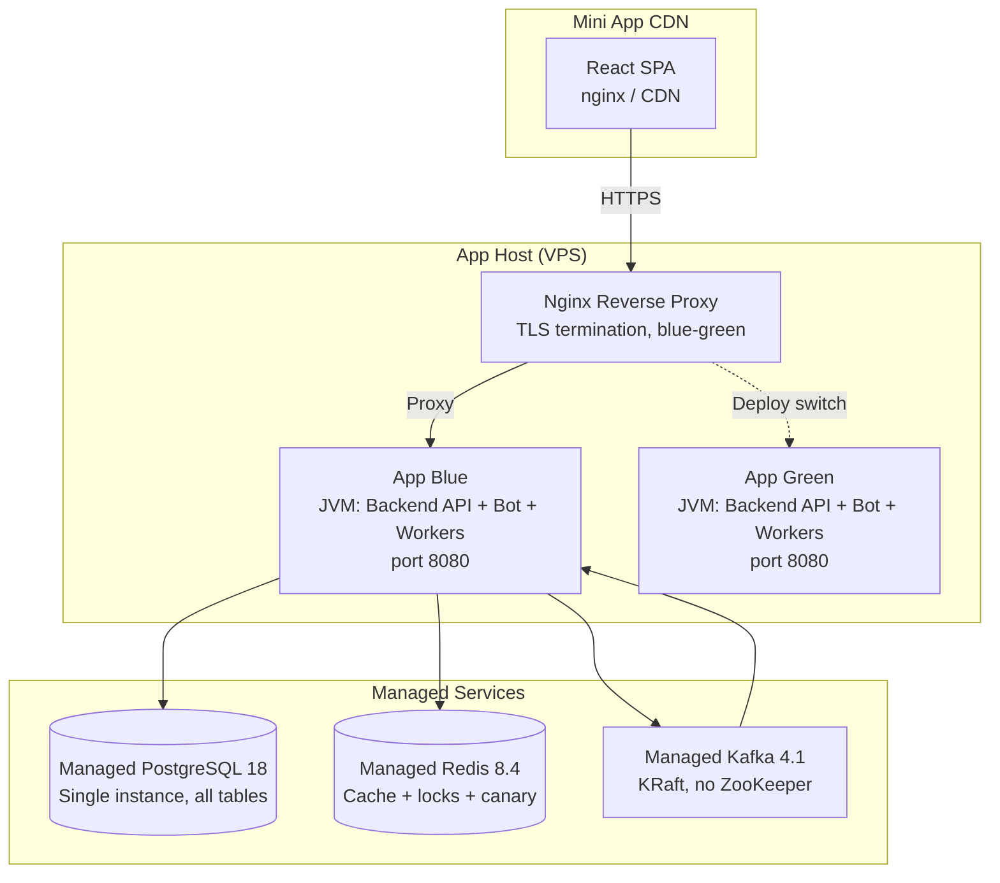
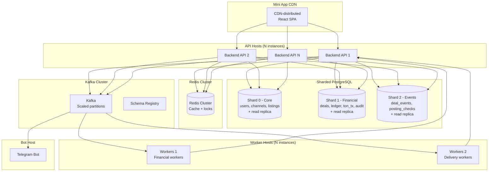

# Deployment

## Overview

Two deployment environments are defined: **MVP** (single-host, minimal ops) and **Scaled** (separated concerns, sharded data, blast radius isolation).

## MVP Deployment

### Characteristics

| Aspect | Detail |
|--------|--------|
| **Description** | Single-host blue-green deployment with canary feature flags |
| **Nginx** | TLS termination, upstream switching (blue/green), `/internal` and `/actuator` access control |
| **App Process** | Single JVM: Backend API + Telegram Bot + Workers (blue-green: two instances, one active) |
| **Mini App** | Static SPA on nginx/CDN |
| **PostgreSQL** | Managed single instance (PostgreSQL 18), all 20 base tables |
| **Redis** | Managed single instance (Redis 8.4) — balance cache + distributed locks + canary config + update dedup |
| **Kafka** | Managed Kafka 4.1 KRaft (no ZooKeeper) |
| **Cost** | Minimal — one VPS + managed services |
| **Scaling** | Vertical (upgrade VPS) |

### Blue-Green Deployment

- Two app instances (blue + green) on the same host
- Nginx switches upstream to the new instance after health check passes
- Zero-downtime deploys: green starts → health check → nginx switch → blue stops
- Canary routing via Redis: `SHA-256(user_id + salt) % 100` routes percentage to canary

### Trade-offs

- Workers share JVM with Backend API — a worker OOM affects the API
- No blast radius isolation between financial and non-financial workers
- Single PostgreSQL instance — all tables on one server
- Acceptable for pre-PMF with low transaction volume

## Scaled Deployment

### Characteristics

| Aspect | Detail |
|--------|--------|
| **Description** | Post-MVP: separated concerns, sharded PostgreSQL, dedicated hosts |
| **API Hosts** | N instances behind load balancer |
| **Worker Hosts** | Dedicated hosts — blast radius isolation |
| **Bot Host** | Dedicated Telegram Bot process |
| **PostgreSQL** | 3 shards with read replicas |
| **Redis** | Redis Cluster (horizontal scaling) |
| **Kafka** | Scaled partitions, Schema Registry |

### PostgreSQL Sharding

| Shard | Tables | Shard Key |
|-------|--------|-----------|
| **Shard 0 — Core** | users, channels, listings, requests, channel_memberships | `user_id` / `channel_id` |
| **Shard 1 — Financial** | deals, ledger_entries, ton_transactions, audit_log, account_balances | `deal_id` |
| **Shard 2 — Events** | deal_events, posting_checks, dispute_evidence | `deal_id` |

Routing via `ShardedDslContextProvider` which routes by shard key.

Each shard has a **primary + read replica** for read scaling.

### Scaling Triggers

| Metric | Threshold | Action |
|--------|-----------|--------|
| API latency p99 | > 500ms | Add API host |
| Worker lag | > 1000 messages | Add worker host |
| PostgreSQL connections | > 80% pool | Add read replica |
| Redis memory | > 80% | Scale cluster |
| Kafka consumer lag | > 10K | Add partitions + consumers |

## Migration Path: MVP → Scaled

1. **Separate workers** from Backend API JVM → dedicated worker hosts
2. **Add API load balancer** with multiple Backend API instances
3. **Shard PostgreSQL** — migrate tables to 3 shards with data migration
4. **Upgrade Redis** to cluster mode
5. **Add Schema Registry** for Kafka schema versioning
6. **Dedicate Bot host** for notification reliability

## Related Documents

- [Containers](./04-architecture/02-containers.md) — logical container view
- [Tech Stack](./08-tech-stack.md) — technology choices
- [Data Stores](./04-architecture/05-data-stores.md) — table details
- [Workers](./04-architecture/04-workers.md) — worker scaling
