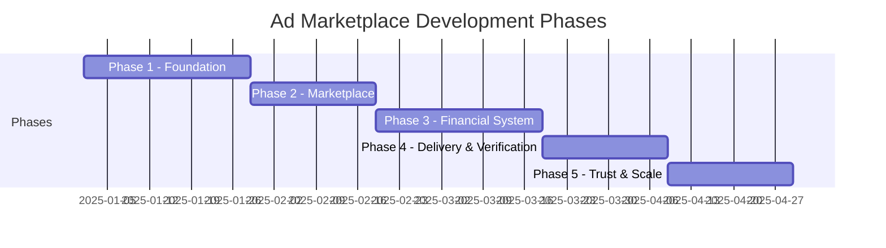

# Development Roadmap

## Overview

The project is divided into 5 phases, progressing from core infrastructure to a fully-featured marketplace with trust mechanisms. Each phase builds on the previous one and delivers testable functionality.

## Phase Summary

## Phase 1: Foundation

**Goal**: Core infrastructure, authentication, basic project skeleton.

### Deliverables

| Component | Tasks |
|-----------|-------|
| **Project setup** | Java 21 + Spring Boot skeleton, Gradle build, Docker Compose |
| **PostgreSQL schema** | Core tables: `deals`, `deal_events`, `channel_memberships` |
| **Auth Service** | Telegram initData HMAC validation, session management |
| **Mini App skeleton** | React 19 + Vite 7, Telegram WebApp SDK integration |
| **Telegram Bot** | Basic bot: `/start`, webhook setup, Bot Command Router |
| **Kafka setup** | Topic creation, producer/consumer configuration |
| **Redis setup** | Connection, basic cache operations |

### Exit Criteria

- User can authenticate via Telegram Mini App
- Bot responds to `/start` command
- Database migrations run successfully
- Kafka topics created and message flow verified

---

## Phase 2: Marketplace

**Goal**: Channel discovery and deal creation flow.

### Deliverables

| Component | Tasks |
|-----------|-------|
| **Channel listings** | CRUD for channel listings, search with filters |
| **Deal creation** | Create deal offer, accept/reject/negotiate flow |
| **Deal State Machine** | Core states: DRAFT → OFFER_PENDING → NEGOTIATING → ACCEPTED |
| **Deal Transition Service** | Actor-checked, idempotent transitions |
| **Deal Flow UI** | Channel browsing, deal creation, timeline view |
| **Team Management** | Channel memberships CRUD, RBAC enforcement |
| **Notifications** | Basic notification pipeline: outbox → Kafka → Bot |

### Exit Criteria

- Advertiser can browse channels and create deal offers
- Channel owner can accept/reject offers
- Deal timeline shows state transitions
- Team members can be invited and managed

---

## Phase 3: Financial System

**Goal**: TON escrow, double-entry ledger, payment processing.

### Deliverables

| Component | Tasks |
|-----------|-------|
| **Ledger Service** | Double-entry append-only ledger, `ledger_entries` table |
| **Escrow Service** | Deposit address generation, hold, release, refund |
| **TON Payment Gateway** | TON Center API integration, address gen, tx submit |
| **TON Deposit Watcher** | Poll for deposits, confirmation policy |
| **Payout Executor** | Execute TON payouts to owners |
| **Refund Executor** | Execute TON refunds to advertisers |
| **Commission Service** | 10% commission calculation |
| **Balance Projection** | CQRS read model, Redis cache |
| **Confirmation Policy** | Tiered confirmation requirements |
| **Escrow UI** | Deposit address QR, payment status tracker |
| **Deal states** | AWAITING_PAYMENT → FUNDED → ... → COMPLETED_RELEASED |

### Exit Criteria

- Advertiser can deposit TON and see escrow status
- Escrow holds funds until verification
- Double-entry ledger records all movements
- Commission correctly calculated and recorded
- Payout/refund executed on TON blockchain

---

## Phase 4: Delivery & Verification

**Goal**: Creative workflow, auto-posting, delivery verification.

### Deliverables

| Component | Tasks |
|-----------|-------|
| **Creative workflow** | Brief submission, draft creation, review/approve |
| **Post Scheduler** | Auto-publish to Telegram channel |
| **Delivery Verifier** | 24h retention checks (deletion/edit detection) |
| **Deal states** | CREATIVE_SUBMITTED → CREATIVE_APPROVED → SCHEDULED → PUBLISHED → DELIVERY_VERIFYING |
| **Deal Timeout Worker** | Auto-cancel/refund on deadline expiry |
| **Notification enrichment** | Creative-specific and delivery-specific notifications |

### Exit Criteria

- Full creative workflow: brief → draft → approve → publish
- Auto-posting to Telegram channel works
- 24h verification detects deleted/edited posts
- Timeout worker handles expired deals
- Successful delivery triggers escrow release

---

## Phase 5: Trust & Scale

**Goal**: Dispute resolution, reconciliation, operator tools, scaling readiness.

### Deliverables

| Component | Tasks |
|-----------|-------|
| **Dispute Service** | Auto-rules engine + operator escalation |
| **Dispute UI** | Dispute filing, evidence upload, resolution status |
| **Reconciliation Service** | Three-way reconciliation |
| **Reconciliation Worker** | Periodic trigger, audit report |
| **Operator tooling** | Dispute review, high-value tx approval, reconciliation dashboard |
| **Audit log** | WORM financial audit trail |
| **PII Vault** | AES-256-GCM field encryption |
| **Idempotency hardening** | Redis locks, PK dedup, state machine guards |
| **Performance** | Redis cache tuning, query optimization, index tuning |

### Exit Criteria

- Disputes can be filed, evidence submitted, resolved by operator
- Reconciliation detects discrepancies and alerts operator
- Audit trail covers all financial operations
- System handles expected MVP load with acceptable latency
- PII encrypted at rest

---

## Post-MVP Considerations

| Feature | Priority | Notes |
|---------|----------|-------|
| Scaled deployment (sharding) | High | When transaction volume justifies |
| Multi-currency support | Medium | Post-PMF |
| Advanced analytics | Medium | Channel performance dashboards |
| API for third parties | Low | External integrations |
| Automated pricing | Low | ML-based price recommendations |
| Debezium CDC | Medium | Replace polling outbox publisher |
| Schema Registry | Medium | Kafka contract versioning |

## Related Documents

- [Product Overview](./01-product-overview.md) — MVP scope
- [Tech Stack](./08-tech-stack.md) — technology choices
- [Deployment](./09-deployment.md) — MVP vs Scaled topology
- [Deal State Machine](./06-deal-state-machine.md) — states added per phase
