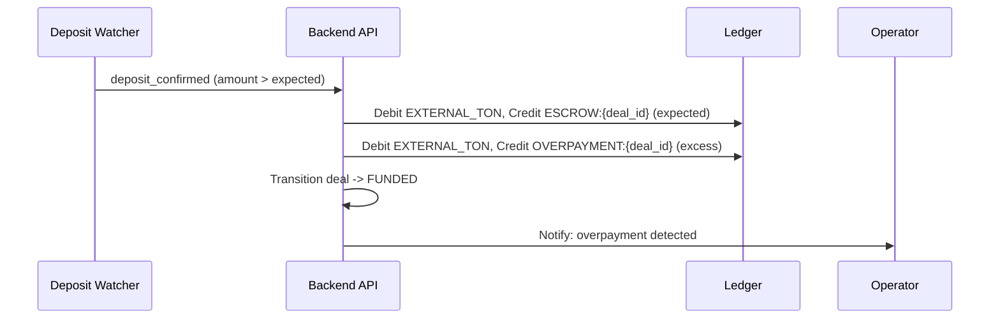
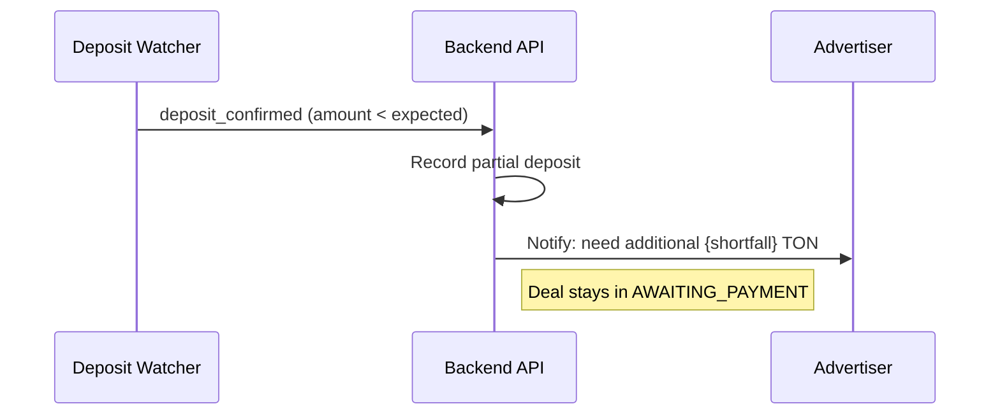

# Overpayment & Underpayment Handling

## Overview

When an advertiser sends TON to a deposit address, the amount may not exactly match the expected deal amount. This spec defines detection and resolution flows.

## Detection

TON Deposit Watcher compares `ton_transactions.amount_nano` against `deals.amount_nano`:

- **Match**: `|received - expected| <= tolerance` -> proceed to FUNDED
- **Overpayment**: `received > expected + tolerance`
- **Underpayment**: `received < expected - tolerance`

**Tolerance**: configurable, default 1_000_000 nanoTON (0.001 TON) to account for network fees.

## Overpayment Flow



### Overpayment Resolution

| Option | Condition | Action | Who |
|--------|-----------|--------|-----|
| Auto-refund excess | `excess > gas_fee_estimate + min_refund_threshold` | Refund `excess - gas_fee` back to source address | System (default) |
| Hold for operator | `excess <= gas_fee_estimate` | Gas fee would eat the excess; hold until operator reviews | Operator |
| Apply to deal | Operator override | Credit full amount to ESCROW:{deal_id} | Operator |
| Manual review | `excess > 10% of deal amount` | Hold in OVERPAYMENT:{deal_id} until operator decides | Operator |

> **Gas fee rule**: overpayment refund is a separate TON TX with its own gas fee (~0.005 TON). If excess is less than gas fee, refund is economically wasteful — hold for manual review instead.

### Ledger Entries (Auto-Refund Excess)

| Step | Debit | Credit | Amount |
|------|-------|--------|--------|
| Fund deal | EXTERNAL_TON | ESCROW:{deal_id} | expected_amount_nano |
| Park excess | EXTERNAL_TON | OVERPAYMENT:{deal_id} | excess_nano |
| Refund excess | OVERPAYMENT:{deal_id} | EXTERNAL_TON | excess_nano - gas_fee |
| Record gas fee | OVERPAYMENT:{deal_id} | NETWORK_FEES | gas_fee |

> **Invariant**: `OVERPAYMENT:{deal_id}` balance = 0 after refund (excess = refund + gas_fee).

## Underpayment Flow



### Underpayment Ledger Tracking

Each partial deposit MUST be recorded in the ledger immediately (not deferred until funded):

| Step | Debit | Credit | Amount | entry_type |
|------|-------|--------|--------|------------|
| Partial deposit received | EXTERNAL_TON | PARTIAL_DEPOSIT:{deal_id} | received_nano | PARTIAL_DEPOSIT |
| Second deposit received | EXTERNAL_TON | PARTIAL_DEPOSIT:{deal_id} | second_nano | PARTIAL_DEPOSIT |
| Threshold reached — promote | PARTIAL_DEPOSIT:{deal_id} | ESCROW:{deal_id} | total_nano | ESCROW_DEPOSIT |

> **Rationale**: Without ledger tracking, money on the subwallet is invisible to reconciliation. `PARTIAL_DEPOSIT:{deal_id}` is a temporary account zeroed when deal transitions to FUNDED.

### Underpayment Resolution

| Option | Action | Who |
|--------|--------|-----|
| Top-up | Advertiser sends remaining amount to same address | Advertiser |
| Adjust deal | Renegotiate deal amount to match received | Both parties agree |
| Cancel + refund | Cancel deal, refund partial deposit (from PARTIAL_DEPOSIT account) | Advertiser or timeout |

### Multiple Deposits

- Deposit Watcher tracks cumulative deposits per deal address
- Each deposit recorded as separate `ton_transactions` record AND ledger entry (PARTIAL_DEPOSIT)
- Running total: `SUM(amount_nano) FROM ton_transactions WHERE deal_id = ? AND direction = 'IN' AND status = 'CONFIRMED'`
- When cumulative >= expected: promote PARTIAL_DEPOSIT → ESCROW, transition to FUNDED
- Timeout (24h from first deposit): cancel + refund all partial deposits

### Reconciliation Check

```sql
-- All PARTIAL_DEPOSIT accounts must match subwallet on-chain balance for non-funded deals
SELECT d.id, ab.balance_nano AS ledger_balance
FROM deals d
JOIN account_balances ab ON ab.account_id = 'PARTIAL_DEPOSIT:' || d.id
WHERE d.status = 'AWAITING_PAYMENT'
  AND ab.balance_nano > 0;
-- Cross-check against subwallet on-chain balance
```

## Configuration

```yaml
escrow:
  payment:
    tolerance-nano: 1000000          # 0.001 TON
    overpayment-auto-refund: true
    overpayment-manual-review-threshold: 0.10  # 10% over
    overpayment-min-refund-nano: 10000000      # 0.01 TON — minimum excess to auto-refund (must exceed gas)
    underpayment-topup-window: 24h
```

## Notifications

| Event | Recipient | Template |
|-------|-----------|----------|
| Overpayment detected | Advertiser + Operator | "Получен перевод {received} TON вместо {expected} TON. Излишек {excess} TON будет возвращён" |
| Underpayment detected | Advertiser | "Получен частичный перевод {received} из {expected} TON. Доплатите {shortfall} TON" |
| Excess refunded | Advertiser | "Возврат излишка {excess} TON. TX: {tx_hash}" |
| Top-up received | Advertiser | "Дополнительный платёж получен. Сделка переведена в статус FUNDED" |

## Metrics

| Metric | Type | Description |
|--------|------|-------------|
| `escrow.overpayment` | Counter | Overpayment events |
| `escrow.underpayment` | Counter | Underpayment events |
| `escrow.overpayment.amount` | Summary | Excess amounts |
| `escrow.underpayment.shortfall` | Summary | Shortfall amounts |

## Related Documents

- [Escrow Payments](../03-feature-specs/04-escrow-payments.md)
- [Confirmation Policy](../07-financial-system/06-confirmation-policy.md)
- [TON SDK Integration](./01-ton-sdk-integration.md)
- [Payout Execution Flow](./30-payout-execution-flow.md)